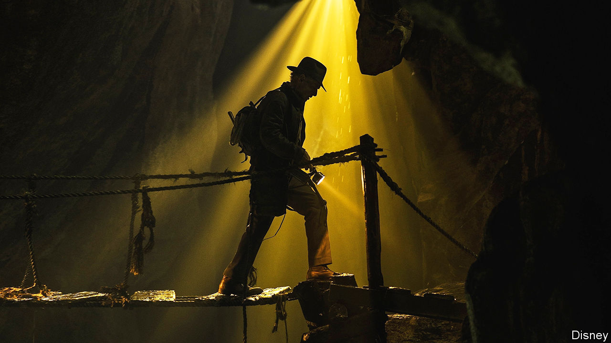

###### Back Story

# Holding out for a hero in 2024 

##### In a jaundiced age, screen heroes are often coated in irony. That is a shame 

 

> Dec 20th 2023 

The setting of “Hallowe’en Party”, a whodunit by Agatha Christie, is, she writes, “an ordinary sort of place”. “A Haunting in Venice”, an extremely loose screen adaptation released in September, moves the action from a nondescript English village to a palazzo on the Grand Canal, stirring in witchery and a séance. Yet amid the added glitz and ghouls, in one important and telling way—typical of a leery, disillusioned age—the film dims the story’s magic. Like other popular franchises, it undermines its own hero, Hercule Poirot. 

“Your mysteries give me faith the wicked will meet justice,” a crime-writer character is told. “Sadly,” she replies, “life doesn’t round out so well as detective fiction.” A suspect complains that “humans are so desperate to shape chaos into tidy stories.” The winking message is: evil cannot really be vanquished by the “little grey cells” of a moustachioed Belgian sleuth. In case you missed it, this is all a fantasy, even a joke.

Poirot is only the latest headliner to endure such self-sabotage. In “GoldenEye” (1995) the spymistress, M, calls James Bond “a sexist, misogynist dinosaur”. His re-education culminates in the finale of “No Time to Die” (2021), a showdown for which he sentimentally clutches a soft toy. In contrast to this relatively abstemious 007, at the start of Indiana Jones’s latest caper the dauntless archaeologist is a boozy has-been. “I don’t need morality lessons from an ageing grave-robber,” his sidekick tells him cuttingly.

You might expect the superheroes of the multiverse to be exempt from such deflation. They are not. In “Avengers: Endgame” (2019) Thor goes to ground after beheading a death-lord. He re-emerges, several pounds over his flying weight, as a beery, burpy slob. When he runs into his mother on a time-travelling mission, she enjoins him to “eat a salad”. Sure, Thor is a god, but he is as fragile and needy as anyone.

There are good reasons to fit your heroes with feet of clay. Flawed characters are more realistic and generally more interesting than idealised ones—as Aristotle outlined in his “Poetics” in the fourth century BC. A drama’s protagonist, he advised, should be noble but imperfect, “true to life and yet more beautiful”. From moody Hamlet to grumpy Rick in “Casablanca”, storytellers have complied. For icons like Bond and Poirot, senescence is also a factor. They are too lucrative to retire yet too familiar to portray without irony. Producers split the difference, at once reviving and ridiculing them. 

But politics, too, is catching up with the heroes of yore, whose habits and attitudes can grate today. It now seems a bit Neanderthal that, for generations, an expertise in violence was their main recommendation. From a 21st-century perspective, Bond’s past attitude to women veered from caddish to borderline criminal. Indiana Jones (pictured) was sometimes disrespectful of the cultures whose treasures he ransacked. Poirot has often been an insufferable know-it-all.

The reformation of the blockbuster hero mirrors the humbling of leaders and luminaries in real life. Offences that were once overlooked in the powerful have become disqualifying for many. Deference is dying; politicians are widely assumed to be on the make or the take. These days the careers of flesh-and-blood heroes seem as likely to end in disgrace as in apotheosis.

Quite right too, in lots of ways. Talent and clout were used as armour against accountability for too long. Too many heroes, and the odd heroine, got away with murder, protected by acolytes and cowing their critics. Hold out for a hero, this history suggests, and they can wind up with an unhealthy hold on you. 

Still, something is lost, on and off screen, when heroes are stripped of their auras and admiration is soured by cynicism. Characters who feel and fail like you are essential to most narratives; but there is still a place, even a need, for heroes and heroines who are nobler and cleverer than other mortals. They do not have to pack heat or crack whips and one-liners. They just have to let you dream that people can be finer, and the world fairer, than they tend to seem: to fulfil a wish without admitting to it. 

You will never be as wise as Henry Fonda’s character in “12 Angry Men”, as intrepid as Jodie Foster’s in “The Silence of the Lambs” or as suave as Cary Grant’s in “North by Northwest”. But in 2024, as much as ever, it would be nice to believe that someone else is, at least until the credits roll. Heroes preside over hierarchies, and those can be abused. But a hero is also hope on legs. ■


