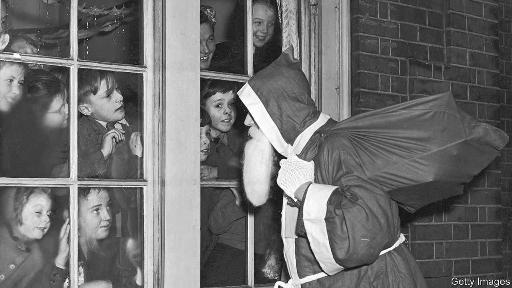

###### Holiday history

# “’Twas the Night Before Christmas” turns 200 this year 

##### How a poem created our modern Christmas customs 

 

> Dec 20th 2023 

It is one of the most famous poems in the English language—almost as famous as Christmas itself. A single word is enough to get going: “‘Twas”. You know the rest, or probably quite a bit of it.

Clement Clarke Moore’s “A Visit from St Nicholas”, better known by its first line, “‘Twas the Night Before Christmas”, was published on December 23rd 1823 and has been cherished ever since. Yet the poem is not just a jolly bit of festive verse. It imagined the details that have given modern Christmas its shape and character.

W.H. Auden, a poet, wrote in 1939 that “poetry makes nothing happen”. “A Visit from St Nicholas” is an unlikely exception. Eight reindeer, with names like Dasher, Dancer, Prancer and Vixen? That comes from Moore’s poem. St Nick coming on Christmas Eve, and not on December 6th, his saint’s day? The poem cemented the shift. But perhaps most important of all, the poem helped transform an unruly winter festival for adults into a peaceful domestic holiday focused on gift-giving and oriented towards children. “A Visit from St Nicholas” tamed Christmas.

The poem has global reach today, but it was first published in the small town of Troy, New York, in the . In early December, on a cold, rainy Saturday, Troy honoured its most famous export at its annual holiday festival. In the shadow of a towering pillar dedicated to Trojans who served in the civil war, a troupe of amateur actors staged a charmingly cheesy skit dramatising the poem’s composition, with the help of an elf, a magical mouse, two reindeer and Santa. That evening, Patrick Madden, Troy’s mayor, decked out in a top hat and a black cape, performed a recitation.

The poem’s extraordinary fame is something of an accident, as are its ties to Troy. It was first published anonymously, but 21 years later its author revealed himself. He was not a Trojan but a wealthy Manhattanite. Moore had never intended the poem to have an audience beyond his children, but a family friend sent the text to the  without his permission. Moore decided to reveal his authorship by including the poem in his collected verse, published at his children’s insistence.

Moore belonged to an upper-crust set known as the Knickerbockers, after a character in a novel by Washington Irving, his friend and fellow Christmas-booster. “You can’t get much more elite than Clement Moore,” says Bruce Forbes, author of “Christmas: A Candid History”. Moore’s father was an Episcopal bishop who served as the president of Columbia College. Moore was an expert on Hebrew and a professor at a seminary established on land he donated. His family estate, called “Chelsea” after the London district, gave the present Manhattan neighbourhood its name. 

A war has been waged over authorship, with descendants of Henry Livingston junior, a writer and officer in the revolutionary war, claiming that he, not Moore, wrote “A Visit from St Nicholas”. Some scholars agree, but most do not. Pamela McColl, who has written a history of the poem, dismisses the claims of Livingston’s authorship as “a bunch of family folklore”.

In Moore’s day, Christmas was not as commonly observed as it is today. There is no mention of it in the Bible, and it is entangled with pagan heritage. Scholars think Christmas was initially celebrated in December in order to piggyback on pre-Christian festivals, including Saturnalia (a holiday that originated in ancient Rome, which featured, among other jocular customs, the crowning of a mock king and masters waiting on their slaves). 

Christmas did not easily shake its Saturnalian roots; it had a party-like atmosphere that makes Mardi Gras look tame. Historically, on Twelfth Night in Britain, the poor could enter the houses of the rich and demand food, drink and sometimes even money in a ritual called “wassail”. (To this day, officers in the British army serve the lower ranks a Christmas meal.) 

In Moore’s New York, which was experiencing a destabilising population boom, gangs would carouse in wealthy neighbourhoods on Christmas. The Knickerbockers sought to do away with that noisy tradition and reshape the holiday. With “A Visit from St Nicholas”, Moore helped inspire its transformation from “a public, rowdy celebration in the streets into a kind of respectable, domestic Christmas”, says Thomas Ruys Smith, a professor at the University of East Anglia. That makes him “the foundational writer of Christmas in the 19th century”, argues Mr Smith. 

“A Visit from St Nicholas” is more sophisticated than its 56 lines suggest. Moore sets his story at home, which replaced the street and pub as the site of Christmas festivities in the Victorian era. He presents Santa Claus coming down the chimney not with a rod to punish wrongdoing but instead with a “sleigh full of toys”. 

Moore’s St Nick is somewhere between a folkloric creature and the modern department-store Santa: “chubby and plump”, yes, but “a right jolly old elf”, who flies in a “miniature sleigh” pulled by “tiny” reindeer. Rather than looking like a fourth-century bishop or sporting the candy-cane colours he would later receive from illustrators, Moore’s St Nick bears all the signs of a working man. He looks “like a peddler just opening his pack”, wearing an outfit “all tarnished with ashes and soot” and smoking a “stump of a pipe”. (Long pipes were reserved for gentlemen.) 

A certain paternalistic vision may underlay this humbling of St Nick; he is a friendly version of the peasants who took over their masters’ houses. But instead of asking for something, he gives. Moore draws the focus away from the holiday’s subversive spirit and “creates this form of gift-giving and people coming to your door in ways that aren’t threatening”, says Maria Kennedy, an expert on folklore at Rutgers University. (Who could fear a guy whose belly jiggles “like a bowl full of jelly”?) 

Moore also scrubs St Nick and the holiday of virtually all religious associations, a move that might have contributed to its broad appeal. Cleansed of class conflict and freed from theological baggage, this was a more appealing Christmas.

Reign of the reindeer

The poem immediately proved popular, spreading in the American press at a speed “more rapid than eagles” (as Moore described St Nick’s sleigh). In the 1850s “A Visit from St Nicholas” was widely reprinted in Britain. Prince Albert might have set down the German roots of the Christmas tree in Britain, but it was Moore’s poem that inspired Britons to hang stockings.

Two hundred years on, merry misrule is safely consigned to memory, and Moore’s vision of Christmas has become widespread. Yet the poem has not yet reached its peak. Sally Veillette, a native of Troy, has commissioned new translations of the poem in 20 languages, including in Italy’s Sicilian dialect and India’s Malayalam. They are available in print and as animated e-books, complete with jingling holiday music. In 2023 Eric Adams, the mayor of New York City, officially proclaimed December 23rd “’Twas the Night Before Christmas Day”. Even the First Lady is getting involved, with early editions of the poem on display at the White House. 

Moore might have preferred to be remembered for his work compiling the first American Hebrew dictionary or for his philanthropy. But books have their own destinies, as the saying goes. Poems do, too. “A Visit from St Nicholas” does not just describe a Christmas miracle: in its extraordinary success and cultural impact, it is one, too. ■


