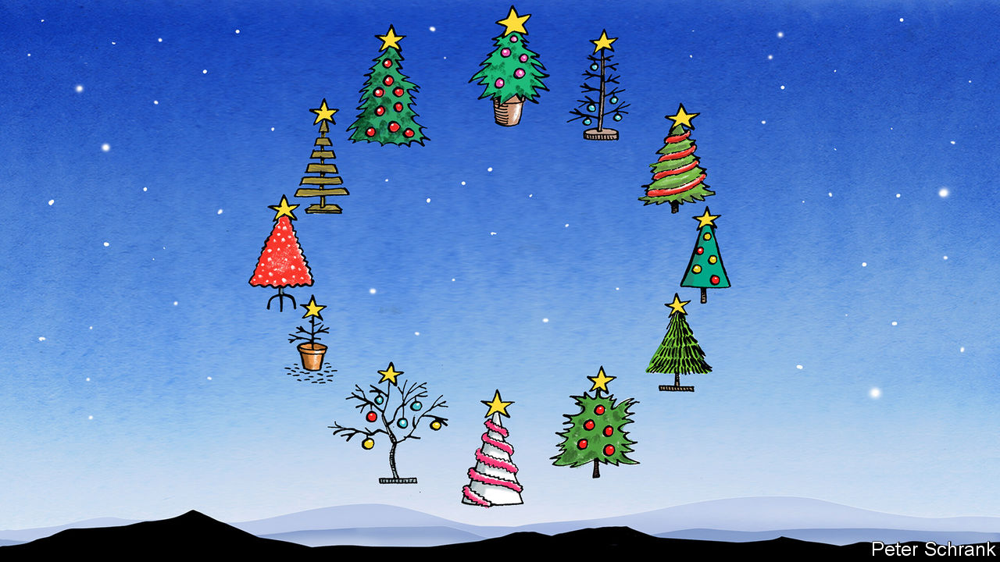

###### Charlemagne

# At Christmas, Europeans look less united than ever 

##### There is no single market for how to celebrate the holidays 

 

> Dec 20th 2023 

Never call a Swede as the sun sets—absurdly early—on Christmas Eve. For at 3pm the country collectively stops in its tracks to watch a bit of televisual lore. Since 1959 the public broadcaster there has served up much the same hour-long show of Donald Duck and other vintage Disney cartoons to the nation’s children and their nostalgic parents. Despite being over six decades old, , as it is known, is among the most-watched shows of the year. Such is its centrality to celebrating Christmas that Swedes living abroad were once known to smuggle versions out on VHS tapes; now YouTube serves up the antique quacking on demand. Sitting down to watch old American cartoons has become as archetypally a part of Swedish national culture as extended paternity leave and couples having blazing rows at IKEA.

New dads getting time off and flatpack marital strife have long since become a pan-European phenomenon, if not a global one. By contrast the Christmas traditions dear to Swedes have remained firmly national affairs, shared only with a couple of Nordic neighbours. A political scientist yet to sign off for the holidays would find much to ponder here. Even as Europe has come together in myriad ways—a common currency across much of the continent, a single set of EU parliamentary elections every five years, a shared horror at the prospect of a second dose of Trumpism—its most intimate moments seldom cross national borders. For much of the year Europe looks like a continent melding into a union, one set of chemicals regulations at a time. But when it comes time to unwind during the festive season, Greeks, Italians and Lithuanians retreat into their national cocoons. 

Beyond a decorated fir tree, twinkling lights and children tearing into gifts, little else is common at Christmas. For God-fearing Poles and Portuguese the birth of Jesus is at the heart of the whole affair; not so for secular Danes and Czechs. (In all circumstances, supposedly Christian celebrations borrow heavily from pre-existing pagan rituals to mark the winter solstice.) Even the date on which Christmas is celebrated varies. Orthodox Christians in the east often mark the day according to the Julian calendar, on January 7th. For those of the Gregorian persuasion, the split is between feasting on the evening of the 24th, as many northern Europeans do, or the day of the 25th, more typical in the south of the continent. The decision can come tinged with geopolitics. Ukraine used to be a January 7th country, alongside Russia. This year it changed by law to become a December 25th one, in line with the EU countries it hopes to join. 

To focus on the day of Christmas itself is to ignore the vital run-up and its aftermath. December 5th is a meaningless date to Portuguese or Irish children. But for Dutch ones (and Belgians, Luxembourgers and others a day later) it marks the all-important visit of Saint Nicholas—and an early trove of presents for children thoughtful enough to leave a carrot in their shoes for his horse to munch on. Scandinavians mark the feast of Santa Lucia a week later, with processions of singing youths, one of whom wears a precarious crown of lit candles. The French have one last dose of gluttony on January 6th, when the three wise men arrived in Bethlehem, with a , an almond-flavoured cake featuring a hidden porcelain charm. On the same date a witch known as La Befana, a mostly unknown acolyte of the trio, delivers yet more goodies to kids in Italy. Her broom-flying powers apparently do not extend to reaching neighbouring Austria or Slovenia. 

Europeans keen to mesh their continent into one ever-closer union are likely to conclude their neighbours are a touch weird. Catalans in Spain feed a hollowed-out log for two weeks before inducing it to poop out small presents on Christmas Eve. Poles and some other central Europeans prepare a table with a spare setting, to symbolise those that could not make it home, or might unexpectedly pop by. Brits attend pantomimes, theatrical performances at which Z-list celebrities (“Oh yes they are!”) indulge in cross-dressing and try to rile up the audience (“Oh yes they do!”). Swedes burn an oversized straw goat. Angela Merkel, then Germany’s environment minister, once used Christmas as an opportunity to show off her housewifely thriftiness by being pictured ironing soon-to-be-reused sheets of wrapping paper. Her fellow Germans on New Year’s Eve watch , a black-and-white piece of British slapstick comedy that few Brits have ever heard of. 

No place like home

Does this cacophony of celebrations matter? The EU’s motto is “united in diversity”; the idea is to allow for a wealth of national customs to co-exist peacefully. Even the most standardisation-mad Eurocrat would hesitate to devise a single menu or television schedule. What little Yuletide harmonisation exists comes from two sources Europeans usually resent. One is Germany, which gave advent calendars, decorated trees and quaint Christmas markets to its neighbours (before invading them repeatedly). The other is America. Although Swedes watch Disney cartoons, much of the rest of the continent sits down in front of .

Elie Barnavi, an Israeli historian, once bemoaned what he called the “frigid Europe” method of EU integration: a continent whose leaders have focused on converging all that is economic and rational, but gave little thought to the cultural and the heart-felt. That approach means the countries in the EU are good at trading widgets or building border-crossing motorways, but their people still think of the rest of Europe as a place that is not really home to them. Can a continent whose people share no affinity in celebrating their most important holiday ever be said to be a true union? Charles de Gaulle quipped that it was impossible to govern a country blessed with 246 types of cheese. Building a continent with so many Christmas traditions will be harder still. Something to reflect on as the Poles enjoy their carp, the French their , Swedes their eels and the Greeks some stuffed cabbage leaves. ■


