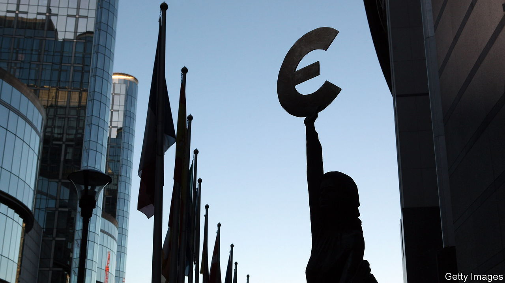

###### How to fund it

# Europe is struggling to find the money 

##### Rows over budget rules have been bitter 

 

> Dec 20th 2023 

The EU’s 27 members have spent freely since early 2020 to support their economies and citizens through a global pandemic, a war on their doorstep and an energy-price surge. Back in 2020 richer northern EU members reluctantly signed up to a debt-funded recovery fund worth €806bn ($880bn, some 5% of EU GDP in 2022) that mostly benefits the south and east of the union. But high interest rates have bent these plans out of shape. 

At a summit on December 14th and 15th all countries bar one reached an agreement on how to top up the EU budget to pay for more financial support for Ukraine (a pot of €50bn over the next four years), as well as higher interest rates on EU debt and extra support for countries facing a surge in the arrival of refugees. The compromise was less generous than the European Commission, the bloc’s executive arm, had hoped for, but it was enough to win almost everyone’s agreement. 

The lone opposition came from Viktor Orban, the prime minister of Hungary. He had just given his tacit agreement to opening membership talks with Ukraine, after the EU released €10bn of funds earmarked for Hungary that had until then been frozen as a punishment for his rule-of-law abuses. His price for approving the larger fiscal package is probably for the EU to unblock Hungary’s remaining and still-frozen €20bn. But his leverage is limited. Ideas being floated to get around his veto include using the European Stability Mechanism (ESM), the euro zone’s bail-out fund which has plenty of spare capacity. If Mr Orban’s bluff is called early next year, he may well fold.

Finance ministers, meanwhile, are still trying to sort out a different fiscal mess. The euro zone’s byzantine deficit rules were barely workable before the covid-19 pandemic. They were too complex, put overly onerous demands on highly indebted countries and led to procyclical budget cuts without making much if any allowance for green investment. When the pandemic struck, the rules were suspended to allow countries to spend freely, and have not been enforced since. With their return due at the start of 2024, they were in desperate need of an upgrade. 

The commission had proposed rules that would give it more power and that would stick less slavishly to numerical targets. Countries would agree to adjustment plans to bring down debt and commit to investments and reforms that would boost growth. But Germany wanted to require countries to lower their deficits and debt by set minimum amounts each year. As  went to press, France was expected on December 20th to give in, after much back and forth, under the rather self-serving condition that these new measures would not fully apply before President Emmanuel Macron’s term is over. 

Over-prescriptive rules can indeed be a problem, as Germany itself illustrates. In November its constitutional court ruled various accounting gimmicks to be illegal under the country’s strict deficit rules. The governing coalition has since then put together budget cuts and tax increases to plug the gaps—at a time when Germany’s economy is stagnant and the country should be investing heavily. Sometimes, muddling through is not enough. ■

