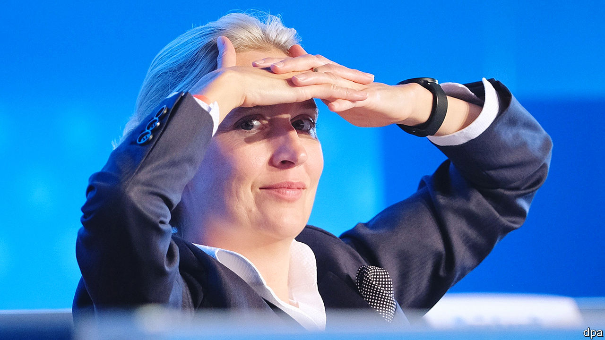

###### The blue queen

# The head of the hard-right Alternative for Germany is riding high 

##### Alice Weidel’s laments for the decline of Germany, and broadsides against immigrants, strike a chord among voters 

 

> Dec 19th 2023 

FROM HER sixth-floor office next to the Bundestag Alice Weidel looks west over an expanse of winter-brown treetops. This is the Tiergarten, Berlin’s most famous park. At its centre rises a 67-metre (220-foot) column celebrating Prussia’s defeat of Denmark in 1864. Glinting in gilded glory at its top strides Victory, this particular version of the winged goddess modelled on the then-crown princess of Prussia, a daughter of Britain’s Queen Victoria.

With her pulled-back blonde hair, sharp nose, erect posture and simple, crisp business attire, Ms Weidel does carry the air of a queen-in-waiting. As the co-leader of the Alternative for Germany (AfD), the furthest-right of the country’s seven main political parties, her influence has been . True, the party, which was launched only in 2013 and represents itself with the colour blue, fields just 78 of the Bundestag’s 736 MPs. It controls none of Germany’s 16 states, and just three small municipal governments. A majority of Germans say they would never vote for it, and the other leading parties have all sworn to shun it. The Federal Office for Protection of the Constitution, an internal-security agency, has put several local AfD branches under surveillance for extremism.

Yet in the 19 months since Ms Weidel rose to the top, the AfD has more than doubled its share of national “voting intentions”, from 10% to well over 20%. That makes it Germany’s second most popular party, after the opposition centre-right Christian Democrats (CDU) but ahead of all three parties in the coalition government. A recent poll suggests that Ms Weidel is more popular than Olaf Scholz, the Social Democrat chancellor.

In elections to the European Parliament in June the AfD is expected to surge far past its current nine seats, echoing a continent-wide trend that has boosted right-wing populists from Sweden to the Netherlands to Italy. In September the eastern German states of Brandenburg, Saxony and Thuringia will head to the polls; the AfD is the leading party in all three. By the next Bundestag elections, due in 2025, Ms Weidel and her co-leader, Tino Chrupalla, could indeed be republican royalty of a sort, as kingmakers rather than monarchs.

Regal bearing aside, the 44-year-old Ms Weidel seems a paradoxical figurehead for the AfD. The party is male-dominated; women make up just one in nine of its MPs compared to 35% across all parties. Mr Chrupalla seems more typical: like many AfD voters, he is an eastern German and proudly working-class. He embodies the resentment against elites that has powered the party through the turbulence of covid-19, high inflation and war in Ukraine. 

Ms Weidel comes from a well-to-do family in a small west German town. She is armed with a PhD in economics, and tends to prefer the controlled arena of the boardroom or studio to flesh-pumping through crowds. Her career trajectory before politics was rocket-fuelled. She worked for Goldman Sachs, a global investment bank, as well as Allianz, an insurance giant, before starting a private consultancy. She spent several years in China, but heeded warnings that it could be a career mistake to be branded a “China hand”.

Openly gay, Ms Weidel lives primarily in Switzerland. She and her partner, a Swiss filmmaker with Sri Lankan origins, are raising two sons, aged seven and ten. Ms Weidel says that although her partner holds “very, very liberal” views—and despite the German media’s intrusions into their privacy—she has been strongly supportive of her political career.

Sipping green tea in her office, the AfD co-chief admits that her decision to take her political convictions into public life has been challenging. Impressed by its anti-euro stance, she worked part-time for the party for four years before getting sucked into national elections, and the limelight, in 2017. Representing a district in the southern German state of Baden-Württemberg, Ms Weidel joined Mr Chrupalla in the leadership in 2022.

Aside from press scrutiny, she and her party now face official surveillance in three German states. “I find it really absurd that Stasi spies read my private correspondence and can listen to my phone conversations although I am an elected opposition leader,” she says. Especially, she adds, since her “cardinal sin” is merely to call for Germany to have secure borders. “Apparently if you don’t say open borders for everybody, then you’re in this far-right corner!”

In Ms Weidel’s telling, most of Germany’s problems can be traced to what she describes as deeply irresponsible immigration policies, particularly the welcome given by Angela Merkel, the chancellor from 2005-21, to an influx of refugees from the Syrian civil war and other migrants. ”I believe politicians must point to the negative sides of certain population groups of Muslims,” she says. “Crime rates have gone through the roof and people from this context, above all Afghans, followed by Iraqis and Syrians, have by far the highest crime burden.”

She also faults immigrants for Germany’s poor showing in a  comparing education across countries. “The level is automatically reduced if they come from a non-[German]-linguistic, non-[German]-cultural and educationally uneducated context,” she says, citing a big recent brawl in a Berlin school involving boys she describes as Middle Easterners. 

Over one-quarter of Germany’s 85m people now have some form of immigrant background. Yet police records show that rather than rising after the migrant surge, the country’s overall crime rate dropped steeply from 2016-21 before going up slightly last year. European rankings of public safety place Germany unremarkably in the middle of the pack. Foreigners do make up a growing proportion of schoolchildren, and tend to score lower than native Germans in tests. But  show narrower differences in neighbouring countries with similar proportions of immigrants. Immigrants in the UK score higher than native-born Britons, suggesting that Germany’s problem may lie with its school system rather than the ethnicity of pupils.

Yet Ms Weidel’s mix of claims of persecution, alarmism, insinuations against immigration and nationalism plays well not only to the AfD base, but to a growing number of Germans. One sign of this was a recent shift by the CDU, the party of Mrs Merkel. A new CDU manifesto issued on December 10th pointedly replaced the phrase “Islam belongs to Germany” with wording that welcomes Muslims “who share German values”.

This surely pleased Ms Weidel, although she also seems to suggest that it may be too late. Germany has already lost its , or “leading culture,” she sighs. And after Mrs Merkel opened a path to ruin, the country’s current left-of-centre coalition has accelerated the decline. “We’ll have to see what’s left of the country when they are done,” she says, daintily replacing her empty teacup in its saucer. ■

