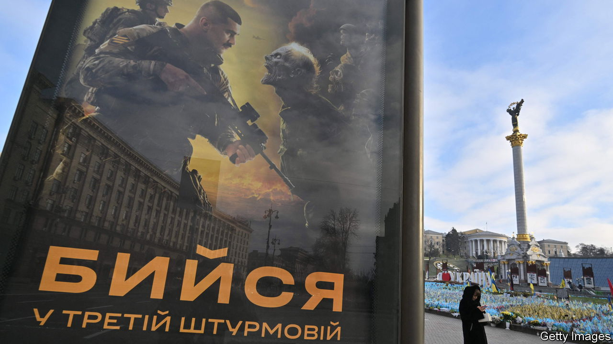
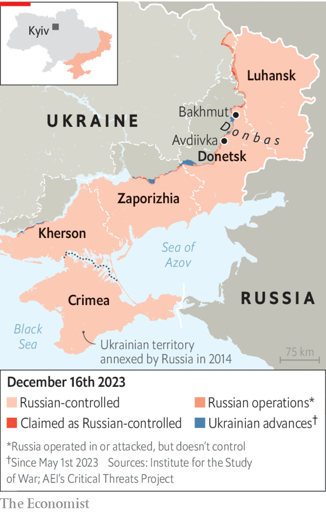

###### Rough draft

# Ukraine’s army is struggling to find good recruits 

##### Russia is suffering immense casualties—but it has the edge in manpower 

 

> Dec 17th 2023 

THE NEW recruits came from a variety of backgrounds, but they shared one thing: after rudimentary training in western Europe, none of them expected to be deployed to an assault unit at the hottest section of the Ukrainian front line. Some had signed up voluntarily, thinking they would to be given places in units that suited their profiles: as drone operators or artillery men. Others were plucked from their villages with little warning. One older recruit didn’t even have the chance to pick up his false teeth. After less than a week in the trenches of the Donbas, in eastern Ukraine, the platoon of 20 had been reduced by six. Three had been killed in action, three seriously wounded. 


This is one of the worst recruitment stories, but it is far from isolated. Ukraine is desperately looking to plug its front lines against new Russian attacks. No army offers new recruits guarantees about where they will be deployed, let alone in wartime, and the assault brigades are among the most desperate units. 

 


But what lawyers describe as a “deployment lottery” is straining the recruitment process. Army chiefs are struggling to fill places with the willing; some are resorting to conscription raids on gyms and shopping centres. Few of those who are signed up this way make good soldiers. “We’re seeing 45- to 47-year-olds,” complains one senior officer. “They are out of breath by the time they reach the front line.”

Recognising the problem, in September Ukraine’s defence ministry began work on a new mobilisation strategy. Illarion Pavliuk, a spokesman for the ministry, says part of the problem lies in the army’s success: many citizens no longer view the war in the existential terms they did immediately after Russia’s invasion in February 2022. “Some mistakenly think there is someone else who can do the job for them,” he says. 

The reforms aim to give those who are wavering more choice: new recruits can, more or less, sign up for a specific position. A new digital register will improve the ministry’s understanding of Ukraine’s manpower resources. There will be a clearer system of rest and rotations. Eventually, volunteers will be mobilised for a finite period, not indefinitely as is the case now. 

There are several examples of successful recruitment campaigns into individual units. The 3rd Assault Brigade, created nine months into the war as a branch of Ukraine’s special forces, is perhaps the most visible. Skyscraper-sized adverts in Ukraine’s cities glamorise life as one of the brigade’s stormtroopers, slaying goblin-like caricatures of evil. But no less important is the brigade’s reputation for competent command, good equipment and low attrition rates. New recruits typically undergo months of training, unlike the one-month standard. 

Khrystyna Bondarenko, a spokesperson for the brigade, says it has no shortage of volunteers. By the start of next year the brigade will be Ukraine’s largest, she says, at around the size of a NATO division. (Ukraine’s army does not have divisions.) The majority of its new recruits are under 25, and she turns down 150 applications a month from minors. “No one is saying there are millions of people waiting to fight in Avdiivka [a town in the Donbas that has recently seen fierce fighting],” she says. “But there are people you can work with.” 

Russia, too, is having difficulty . Its tactic of hurling vast numbers of men at defended positions, often without proper equipment, can mean . But the fundamentals point to a gargantuan challenge for Ukraine. With a pool of potential soldiers about four times greater, Russia looks favoured in the long run. In its prisons and poorest areas, joining the army looks rational.

Elsewhere, the Kremlin has been able to meet its minimum needs with secret recruitment for a full-scale war that it still pretends is not happening. If it did need to ramp up its mobilisation the Kremlin would need to admit that Russia is at war. That would not be without political consequences.

Ukrainian critics of the government in Kyiv, meanwhile, charge that the country is only “pretending to mobilise.” Viktor Kevlyuk, a retired colonel who oversaw the implementation of mobilisation policy for the western half of the country from 2014—when Russia first invaded—to 2021, says Ukraine risks falling into a trap. Russia will step up its mobilisation after its presidential election in March is over, he thinks. (HUR, Ukraine’s military-intelligence agency, agrees.) 

Vladimir Putin has already signed an edict increasing the size of Russia’s armed forces by 170,000. Colonel Kevlyuk argues that Ukraine must respond with a nationwide mobilisation of industry, government and resources. The often-decadent lifestyles of those enjoying safety in Kyiv need to change, he thinks. “This is not a time for imported smoked salmon.” 

Throughout the war Volodymyr Zelensky has resisted the maximalist urgings of his soldiers, much to their chagrin. His top generals have, for example, pushed to lower the age at which non-reservists can be mobilised, which currently stands at 27. Others have proposed a stricter implementation of mobilisation laws. 

The president has pushed back partly for political reasons: he does not want to irritate the population unnecessarily. But Mr Zelensky is also driven by more noble concerns. “Zelensky wants to do the right thing by Ukrainians,” says a high-level government source. “He doesn’t want to be a dictator”.

Tough decisions lie ahead. For Colonel Kevlyuk, the army is a beast that must be fed: “We have no choice other than to be bloodthirsty,” he says. But some officials prefer a more consensual approach. The high-level source predicts media campaigns promoting national sacrifice and warning that Russia continues to pose an existential threat. “If we lose, it will be bad for all of us,” he says. 

The task is to convince potential recruits. “Conductor”, one of the men deployed to the ill-fated unit in the Donbas, says he is committed to serving his country, “but only in a way that can be useful”. In the meantime he is occupied “24/7” in securing a transfer away from the assault forces. “You can’t just write people’s lives off like this,” he says. ■

