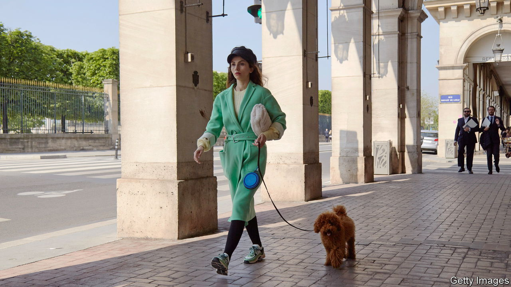

###### French style

# Why French women no longer wear high heels 

##### A footwear revolution in the world’s fashion capital 

 

> Dec 20th 2023 

The high-heeled shoe, popular among men in pre-revolutionary France, is losing favour among women on the streets of Paris. The once familiar click of stiletto on cobble is giving way to the silence of rubber soles. Today fashion writers offer French women advice on “”: heavy, black, grooved-sole footwear. Trainers, once derided in the  as an American abomination, are now a daily feature in Parisian cafés and offices. Nearly half of French women, according to a poll, do not know how to walk in high heels. What is going on?

Modern France helped to make the female high heel iconic. Roger Vivier, a French designer, is considered to be the godfather of the stiletto, having designed the  (needle) heel back in 1954. He was the first to insert a metal rod into the heel, stiffening its structure and stretching the female silhouette. The brand still calls stiletto heels “tools of unstoppable seduction”. Christian Louboutin, a French luxury designer, gave the 10cm-high heel a twist with his famous red-soled stiletto, a pair of which goes for around €800 ($870).

Today’s disappearing French high heel is explained in part by covid-19 and the way working from home has spread . It may also mark a form of post-#MeToo rebellion. A younger generation is turning against the stiletto’s figure-deforming nature—nodded to in the film “Barbie”, whose star’s feet no longer fall flat when relieved of her heels.

During the festive season the high heel—or at least a block version of it—may be enjoying a revival. But this could be fleeting. On the French high street, the trend seems entrenched. “ That’s over,” says a Parisian shoe-shop manager when asked if she sells many stilettos, waving at the limited range she has relegated to an upper shelf. “Women want comfort,” says an assistant at another store. “What matters is that you can wear flat chunky boots with an elegant dress, and still be chic.”■

