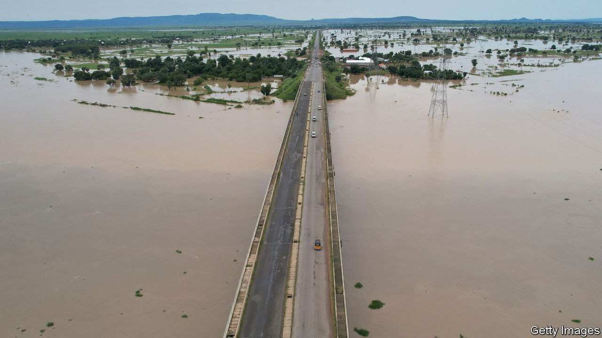
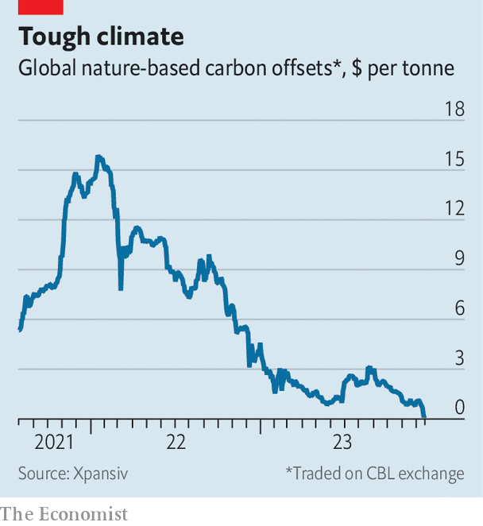

###### Love the sinner

# Can the carbon-offset market be saved? 

##### Market prices have crashed 

 

> Dec 20th 2023 

“As soon as a coin in the coffer rings, the soul from purgatory springs,” ran an early advertising jingle attributed to Johann Tetzel, a 16th-century indulgence salesman. Funding the church offered believers an alternative to paying for sins in the afterlife. The carbon-credit market promises something similar. Instead of reducing your carbon footprint, why not simply pay someone else to do it for you? 

It is a nice idea. Yet the voluntary carbon market—as opposed to compliance markets, such as the EU’s emissions-trading scheme—is in turmoil. Latter-day Martin Luthers, whose objections to Tetzel led to the Reformation, have pointed out that offsets struggle to prove they make a difference to emissions: renewable projects are often viable on their own, thus providing funding does not lower emissions. 

 


Scandals have also sapped investor appetite. A report by the , a British newspaper, alleged that many leading “nature-based” offsets, which usually attempt to restore forests, are junk. Activists argue that middle men hog the proceeds and indigenous people fail to benefit. Prices for nature-based offsets plunged from $15 a tonne after the COP climate summit in Glasgow two years ago to a disastrous $0.10 a tonne after the recent meeting in Dubai, according to Xpansiv, an exchange.

Reformers were at the summit in force, with proposals for how to fix the market. These include plans to verify, tally and register offsets. Six outfits, including the Voluntary Carbon Markets Integrity Initiative, which provides advice on how to use credits, and the Integrity Council for the Voluntary Carbon Market, which aims to set offset rules, launched what they called an “end-to-end integrity framework”. 

The hope is that such reassurance might tempt back corporate buyers. McKinsey, a consultancy, has estimated that the market value of voluntary offsets could reach $50bn by 2030, up from $2bn or so today, given the number of firms that have vowed to decarbonise supply chains. Banks have begun to open trading desks to buy and sell offsets. On December 4th the Commodity Futures Trading Commission, an American regulator, published guidance on how it will regulate markets. 

Vast flows of private finance could provide money for poor countries to fight global warming. America’s state department therefore outlined plans for its own carbon-offset scheme at COP, through which firms could pay countries to clean up electricity production. The Dominican Republic and Nigeria have signed up. So have McDonald’s, a fast-food chain, PepsiCo, a consumer-goods firm, and Bank of America. 

The Rockefeller Foundation, which is working with the state department, also supports a similar scheme. The idea is to mix private investment, loans and carbon credits to reduce the cost of replacing coal with renewables. The first deal has been agreed between ACEN, a Filipino energy firm, and the Monetary Authority of Singapore, the island-state’s central bank. Companies will be able to use credits to pay the territory’s carbon tax from 2024.

Countries also inked deals under a provision of the Paris agreement on climate change that allows them to co-operate in meeting emissions promises. Switzerland came to an agreement with Ghana under which it will fund four waste facilities. Singapore signed a deal with Papua New Guinea that will allow it to count some of the latter’s emissions cuts as its own.

Yet negotiations over a final rule book for bilateral deals, as well as a carbon-credit market with the imprimatur of the UN, went nowhere. Negotiators clashed over how much transparency to require. Without nationally accredited schemes, firms will have to turn to the “Wild West” of the voluntary market, says Mandy Rambharos of the Environmental Defence Fund, a charity. The danger is that bad press provides an excuse for firms to withdraw from the market altogether. After cop, the price of nature-based offsets fell even further; the hope is that they will rise once the reforms are actually implemented. For carbon sinners, heaven can wait. ■


