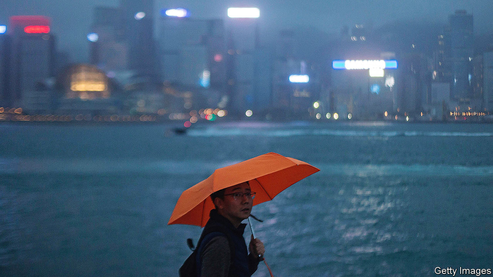
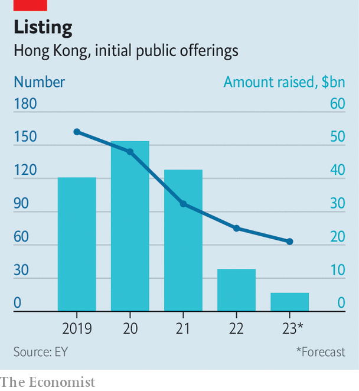

###### Lost half-decade

# Hong Kong’s problems trace back to China. And also America 

##### The “superconnector” suffers the worst of both worlds 

 

> Dec 20th 2023 

Sevva, a swanky bar and restaurant with electrifying views, has been serving bankers and sightseers for more than 15 years. From its terrace, you can peer over a cocktail and through the office windows of HSBC across the road. The restaurant’s cuisine is meant to be “fresh, simple and honest”. Yet it is not cheap. An oversized dosa, a humble South Indian breakfast food, will set you back HK$380 (almost $50). Some patrons eat them with a knife and fork. 

In May, sadly, the restaurant will close. That has not helped the morale of the city’s beleaguered financial industry. Hong Kong’s main stockmarket index has plunged by more than a quarter since late January. Its index for smaller, “growth” enterprises is well below the trough it reached in October 2022, before China began lifting the quarantine requirements that starved Hong Kong of visitors. 

 


Amid such depressed sentiment, the money raised from initial public offerings came to just HK$37bn in the first 11 months of 2023 (see chart), the least for 20 years. Mainlanders have described Exchange Square, where the bourse is located, as a “ruin”. Unlike New York’s financial district, which features a bronze statue of a charging bull, the square features two bronze water buffalo, one lying flat.

Financial services account for more than a fifth of Hong Kong’s GDP. It is therefore hard for the city to prosper when its bankers do not. In July some forecasters expected Hong Kong’s economy to grow by 6% in 2023. Now the consensus is only 3.3%. That means Hong Kong’s GDP is smaller than it was in 2018, the year before anti-government protests broke out. It amounts to a lost half-decade. 

Even Hong Kong’s notoriously expensive property market has suffered. Prices have fallen by almost 20% since their peak. In October the city cut in half stamp duty for foreign buyers and buyers of multiple properties. Capital Economics, a research firm, notes that it was the first relaxation of property-buying curbs since 2010. 

What explains Hong Kong’s woes? Sevva’s founder cited the covid-19 pandemic and the “social movements of 2019”, which “posed enormous challenges” to the restaurant’s operations. In response to protests about the mainland’s growing influence, China’s government imposed a strict national-security law, which has further eroded the city’s autonomy. That has made it harder for Hong Kong to fulfil its coveted role as a “superconnector” between China and the rest of the world. John Lee, the city’s leader, could not attend the APEC forum in San Francisco in November because he is under American sanctions. 

Since the protests were quashed, the authorities have worked hard to bring Hong Kong and the mainland closer together. Whether or not this message has taken root among residents, it seems to have prevailed among foreign investors, some of whom now see little distinction between Hong Kong and the rest of China. 

But the truth is that Hong Kong’s financial industry and property market remained strong after the national-security law was introduced in June 2020. IPOs, for example, brought in almost HK$329bn in 2021, 15% more than in 2018. Property prices did not peak until the end of 2021.

China’s crackdown on Hong Kong has probably done less immediate harm to the territory’s financial markets than another crackdown: Beijing’s regulatory campaign against mainland property developers and internet firms, many of which are listed in Hong Kong. Strict financial limits imposed on developers caused a wave of defaults on bonds issued in Hong Kong. Investors have learnt that unsecured debt issued offshore by a mainland company’s subsidiary or offshoot sinks to the bottom of the pecking order when things go wrong. 

As well as diminished autonomy from the mainland, Hong Kong also lacks autonomy from America’s Federal Reserve. To maintain its currency peg to the dollar, the city has been forced to raise interest rates sharply, despite low inflation and the fragility of its recovery. High interest rates have hurt the property market and the broader economy. The high cost of capital may have encouraged firms to run down their inventories, contributing to the sharp slowdown in growth in the second quarter, argues Goldman Sachs, a bank. 

The currency peg has also meant that Hong Kong has lost competitiveness against some of its neighbours. Its currency has risen by 6% against the yuan since the end of January, even as prices in China have been falling. Weak exports and strong imports are likely to subtract more than two percentage points from Hong Kong’s growth this year. Hong Kong is not just another Chinese city. If it were, it would have a more competitive currency. 

Days of being wild

When China dismantled its quarantine regime a year ago, Hong Kong’s boutiques, hotels and restaurants expected an influx of mainlanders. In the first ten months of the year, 21m showed up. Yet that was only 52% of the number that arrived in the same period of 2018. These visitors also seem to be spending less. Indeed, many of them are opening bank accounts and buying life-insurance policies to take advantage of the city’s higher interest rates. 

Instead of mainlanders flocking to Hong Kong, the city’s residents are travelling in the opposite direction. Their departures (mostly to other parts of China) now outnumber mainland arrivals by almost three-to-one, points out Citigroup, another bank. After a recent visit to Hong Kong, John Greenwood, one of the architects of the territory’s dollar peg, was reminded of “episodes from the distant past” when British consumers crossed the Channel to France to buy booze and food.

But all this gloom has an upside. If the Fed does cut interest rates in 2024, as futures markets expect, Hong Kong’s domestic economy should respond vigorously. As financial conditions ease and Hong Kong’s currency weakens, the deals and the visitors might return. Although Hong Kong is losing one of its most iconic restaurants, the city’s appeal will endure. It will remain a place where people from around the world can enjoy a taste of Asia without giving up familiar utensils. ■


