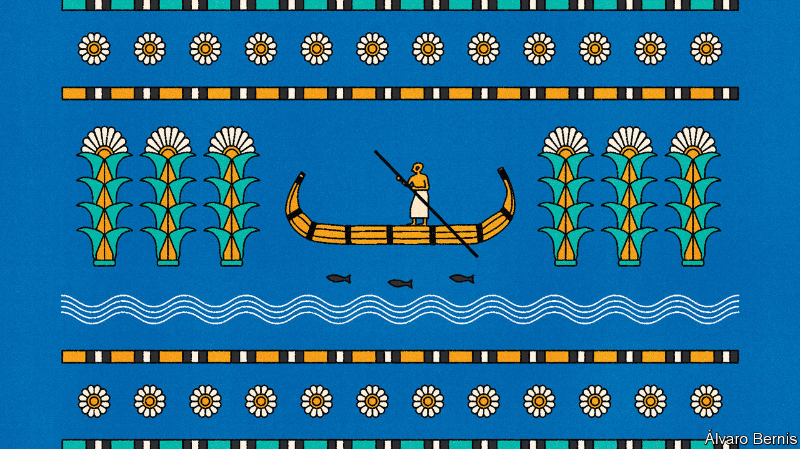

###### Free exchange

# Where does the modern state come from? 

##### Economists attempt to answer a profound political question 

 

> Dec 20th 2023 

It is part metaphor, part myth and part history. Thomas Hobbes thought life there was nasty, brutish and short. John Locke disagreed, proclaiming that it was where people first learnt how to own things. Jean-Jacques Rousseau described it as the place where people were born free, before they became ensnared in chains. Robert Nozick thought that people were so desperate to escape it, there was an inevitable result: the creation of a state. 

Ideas about the “state of nature”—how people lived before politics organised itself into governments—have held the attention of philosophers for centuries. Discovering whether it played out as imagined was nigh-on impossible. And yet thinking about what people would do without a government helped answer profound questions. What are the limits of political power? Is the modern state something that citizens would freely choose?

Now, after all this theorising, three economists think they have some empirical answers. According to Robert Allen of New York University, Abu Dhabi, Leander Heldring of Northwestern University and Mattia Bertazzini of the University of Nottingham, the key to understanding the emergence of modern politics is not a metaphor, but the constantly shifting courses of ancient rivers in Iraq. The first states, they argue in a paper published in the , were glued together not as shelters from violence, as Hobbes believed, but by economics.

The banks of the Tigris and the Euphrates, Iraq’s two longest rivers, are home to some of the world’s oldest settlements. Mesopotamia, which 5,000 years ago refined the first known system of writing, earned the area the reputation of “the cradle of civilisation”. The paths of these rivers shift, as floods and droughts cause their beds to flood. When a shift came, some ancient farmers were left without water for their crops.

Mr Allen and his co-authors investigate whether the timing of changes to a river’s course had anything to do with when the number and size of settlements grew. They do so by looking at the effect of the first recorded shift in 2,850BC. This presented farmers with something close to the choice imagined by philosophers when theorising about the state of nature. Those left behind by the river could revert to nomadism. Or they could band together to build irrigation systems to ferry water from distant rivers. 

A philosophical question is therefore transformed into something akin to a laboratory experiment, only one set thousands of years ago and extending hundreds of miles across. Moreover, the results of the experiment are clear. A 5km-by-5km square in the basin left behind by a river was 14% more likely to have a settlement, marked by a public building such as a temple or marketplace, 150 years after the shift than in the 50 years before it. Each square was 12% more likely to have a built canal, a form of artificial irrigation that made farming far from rivers possible. Five new cities were created, and only three abandoned. Esnunna, one city along a new tributary of the river, became much bigger. 

This, Mr Allen and his co-authors say, is evidence that that the fist states were formed by farmers co-operating for economic reasons. A canal network would have been too large a cost for any to bear alone. But by spreading the cost, the construction was worth it for each. Such decisions were momentous. They represent some of the earliest examples of governments providing infrastructure in return for taxes, and thus the genesis of the earliest states. 

The authors then divide centuries of thinking on the origins of states into two camps. The first, which they say ranges from Daron Acemoglu, an influential economist at the Massachusetts Institute of Technology, to Karl Marx, supposes that states ultimately emerge from a process of social bargaining. The rich and high-status seize power for personal gain, and periodically dole out services, such as a road, school or police force, in order to keep populations on board. But if this had been the case in Mesopotamia then it would have been in the areas that a river shifted towards that settlements would have formed. After all, they developed richer and more fertile farmland, yielding a bigger tax take.

That Mesopotamian farmers seem to have chosen to band together as the river shifted away lends support to the second camp. Philosophers in this group, who include Locke and Rousseau, contend that governments emerged when people chose to co-ordinate themselves, swapping their freedom to do whatever they wanted for a state that mediates disputes and provides a degree of safety. Mr Allen and his co-authors analyse only Mesopotamian Iraq, but they argue that their results ought to apply more generally to other fledgling states. Governments, in other words, are chosen rather than foisted upon their citizens. 

Meandering path

This is quite the landgrab by economists, seizing terrain that is more commonly occupied by political theorists. The study is not flawless. Perhaps an unknown conquest explains the spread of settlements in the period under consideration. Maybe the authors are wrong and the pattern does not hold elsewhere. There were already six cities and many more settlements in the Mesopotamian Valley before its rivers really began to move, and some had existed for a thousand years. The authors insist that they are only interested in how new governments form, but there is a chance they have in fact captured older ones spreading. 

The paper is nevertheless bold and valuable. Philosophers have sought for centuries to explain why states emerge. Too little time has been spent considering whether economic factors might have been at play. Although transforming the state of nature into a specific time and place means losing some of its complexity, doing so opens the door to the sort of experiment that could only have been imagined by earlier philosophers. If Hobbes or Locke could have studied something approximating the state of nature about which they were theorising, they surely would have tried. ■


