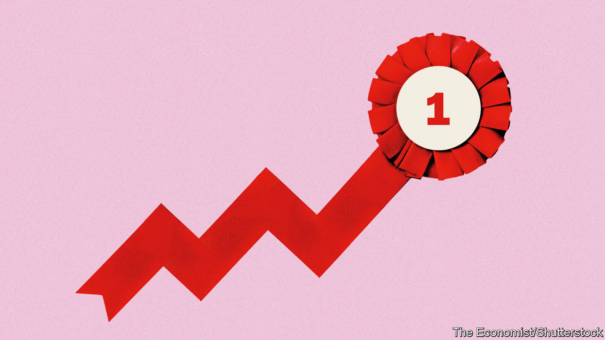

###### From the ruins

# Which economy did best in 2023? 

##### Another unlikely triumph 

 

> Dec 17th 2023 

Almost everyone expected a global recession in 2023, as central bankers raised interest rates to cool inflation. The consensus was wrong. Global GDP has probably grown by 3%.  have held up. Inflation is on the way down. Stockmarkets have risen by 20%. 

But this aggregate performance conceals wide variation.  has compiled data on five indicators—inflation, “inflation breadth”, GDP, jobs and stockmarket performance—for 35 mostly rich countries. We have ranked them according to how well they have done on these measures, creating an overall score. The table shows the rankings, and some surprising results. 


Top of the charts, for the second year running, is —a remarkable result for an economy that was until recently a byword for mismanagement. Aside from South Korea, many of the other standout performers are in the Americas. The United States comes third. Canada and Chile are not far behind. Meanwhile, lots of the sluggards are in northern Europe, including Britain, Germany, Sweden and, bringing up the rear, Finland. 

Tackling rising prices was the big challenge in 2023. Our first measure looks at “core” inflation, which excludes volatile components, such as energy and food, and is a good indicator of underlying inflationary pressure. Japan and South Korea have kept a lid on prices. In Switzerland core prices rose by just 1.3% year on year. Elsewhere in Europe, though, many countries still face serious pressure. In Hungary core inflation is running at 11% year on year. Finland, which is heavily dependent on Russian energy supplies, is also struggling.

In most countries inflation is becoming less entrenched—as measured by “inflation breadth”, a measure that calculates the share of items in the consumer-price basket where prices are rising by more than 2% year on year. Central bankers in places including Chile and South Korea increased interest rates aggressively in 2022, sooner than many of their peers across the rich world, and now appear to be reaping the benefits. In South Korea inflation breadth has fallen from 73% to 60%. Central bankers in America and Canada, where inflation breadth has dropped even more sharply, can take some credit, too. 

However, in other places, the battle against inflation is not even close to being won. Take Australia. Inflation there remains firmly entrenched, with the price of close to 90% of the items in the average person’s shopping basket rising by more than 2% year on year. Worse, inflation breadth is not coming down either. France and Germany are also in trouble. And so is Spain, where inflation seems to be becoming more entrenched over time. 

Our next two measures—growth in employment and GDP—hint at the extent to which the 35 economies are delivering for ordinary folk. Nowhere fared spectacularly well. Across the world productivity growth is weak, limiting potential increases in gdp. Already tight labour markets at the start of 2023 meant there was little room for improvement when it came to jobs. 

Only a few countries, though, actually saw their GDP decline. Ireland was the worst performer, with a drop of 4.1% (take that with a pinch of salt: there are  with the measurement of Irish GDP). Estonia, another country whacked by the fallout of Russia’s invasion of Ukraine, did badly.  and  also underperformed. Germany is struggling with the consequences of the energy-price shock and rising competition from imported Chinese cars. Britain is still dealing with the aftermath of Brexit—most economists expect the country to suffer from weak economic growth in the coming years. 

, by contrast, did well on both GDP and employment. It has benefited from record-high energy production as well as a generous fiscal stimulus implemented in 2020 and 2021. The world’s largest economy may have pulled along other countries. Canada’s employment has risen smartly. Israel, which counts America as its largest trading partner, comes fourth in the overall ranking, although its war with Hamas, which began in October, makes the outlook for 2024 deeply uncertain.

You might think that the American stockmarket, stuffed with firms poised to benefit from the revolution in artificial intelligence, would have done well. In fact, adjusted for inflation it is a middling performer. The Australian stockmarket, filled with commodities firms managing a comedown from high prices in 2022, underperformed. The Finnish stockmarket had a poor year, with the share price of Nokia, a national champion, continuing its long, slow decline. Japan’s firms, by contrast, are experiencing something of a renaissance. For that, thank reforms to corporate governance, which finally seem to be bearing fruit. The country’s stockmarket was one of the best performers in 2023, rising in real terms by nearly 20%.

But for glorious equity returns, look thousands of miles west—to Greece. There the real value of the stockmarket has increased by more than 40%. Investors have looked afresh at Greek companies as the government implements a series of pro-market reforms. Although the country is still a lot poorer than it was before its almighty bust in the early 2010s, the imf, once Greece’s nemesis, praised “the digital transformation of the economy” and “increasing market competition” in a recent statement. While underperforming Finns can console themselves this Christmas by drowning their sorrows alone in their underwear (or getting , as it is known locally), the rest of the world should raise a glass of ouzo to this most unlikely of champions. ■


