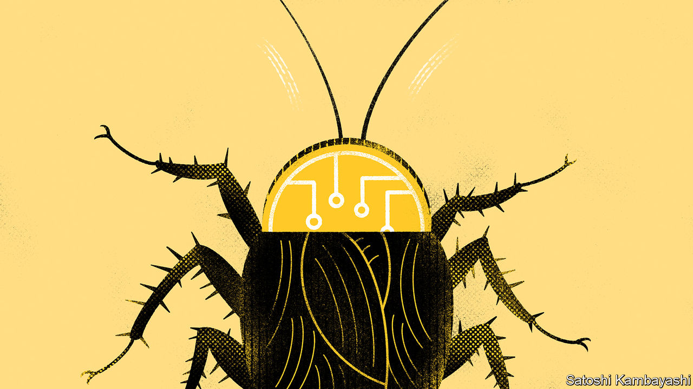

###### Buttonwood

# Why bitcoin is up by almost 150% this year 

##### Introducing the cockroach theory of crypto 

 

> Dec 18th 2023 

Chopping off their heads does not work: cockroaches can live without one for as long as a week. Whacking them is no guarantee either: their flexible exoskeletons can bend to accommodate as much as 900 times their body weight. Nor is flushing them down the toilet a solution: some breeds can hold their breath for more than half an hour. To most, roaches are an unwelcome pest. Their presence is made all the worse because they are indestructible. 

An unwelcome pest is how many financiers and regulators would describe the crypto industry. Criminals use cryptocurrencies to launder money. Terrorists use them to make payments. Hackers demand ransoms in bitcoin. Many crypto coins are created simply so their makers can make off with the money. 

The industry also appears to be indestructible. Crypto prices were crushed by higher interest rates in 2022. The industry’s head has been chopped off: Changpeng Zhao and Sam Bankman-Fried, the founders of the world’s biggest and second-biggest crypto exchanges, now both await sentencing for financial crimes (breaking anti-money-laundering laws and fraud, respectively). Regulators are cracking down. Yet not only has crypto survived, it is once again soaring: bitcoin climbed to a two-year high of almost $45,000 on December 11th, up from just $16,600 at the start of the year.

What is going on? For one thing, indestructibility is built into the technology. Bitcoin, ether and other coins are not companies—they cannot go bankrupt and be shut down. They employ blockchains, which maintain a database of transactions. Their lists are verified by a decentralised network of computers that are incentivised to keep maintaining them by the promise of new tokens. Only if the tokens fall to zero does the whole architecture collapse. And there continue to be lots of reasons to believe some crypto tokens are worth more than nothing. 

The first is that holding crypto is a bet on a future in which use of the technology is widespread. People in despotic countries already use bitcoin and stablecoins (tokens pegged to a hard currency, like the dollar) to store savings and sometimes to make payments. These could be used more widely. Artists and museums are still creating or collecting non-fungible tokens (nfts). As are those looking to flog an image. Donald Trump is selling his mugshot for $99 a piece; he plans to have the suit he was booked in cut into pieces, made into cards and given to punters who buy at least 47 nfts in a single transaction. 

During the boom times, the crypto industry raised a lot of money and hired plenty of smart developers. Those that remain are working on new uses, like social-media applications or play-to-earn games. Perhaps these will never be widely adopted. But even the small chance that they work out is worth something. 

The second reason is that, with each boom-and-bust cycle, it becomes clearer crypto is not a bubble like tulip mania in the 1630s or the craze for Beanie Babies in the 1990s. Although bitcoin is a volatile asset, its price history looks more like a mountain range than a single peak, and appears closely correlated with tech stocks. Yet it is only moderately correlated with the broader market. An asset that swings up and down, and not in parallel with other things people might have in a portfolio, can be a useful diversifier.

That bitcoin has established itself as a serious asset seems to be the source of the latest surge. In August an American court ruled that the Securities and Exchange Commission, America’s main markets regulator, had been “arbitrary and capricious” when rejecting an effort by Grayscale, an investment firm, to convert a $17bn trust invested entirely in bitcoin into an exchange-traded fund (etf). Doing so would make investing in bitcoin easier for the average punter. 

In October the court upheld its ruling—in effect ordering the sec to give way. The biggest fund managers, including BlackRock and Fidelity, have also applied to launch etfs. Given the returns bitcoin has offered in the past, and its correlations with other assets, the result could be a rush of cash into bitcoin, as even sensible investors consider putting small slices of their pension pots or portfolios into crypto for diversification.

Many feel instinctive revulsion when they spy a roach. But in spite of their flaws, the bugs have uses—they turn decaying matter into nutrients and eat other pests, such as mosquitoes. Crypto has its uses, too, such as portfolio diversification and keeping money safe under despotic regimes. And, as has been shown, it is just about impossible to kill. ■


