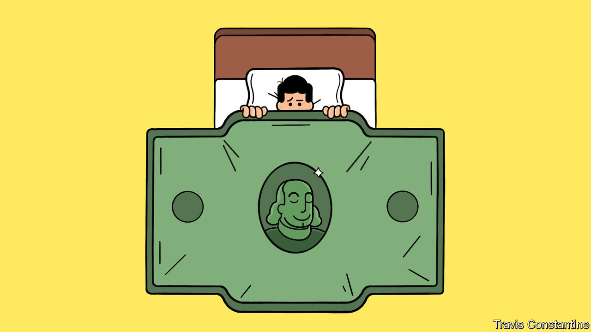

###### A dismal year for the dismal science

# Economists had a dreadful 2023 

##### Mistaken recession calls were just part of it 

 

> Dec 20th 2023 

Spare a thought for economists. Last Christmas they were an unusually pessimistic lot: the growth they expected in America over the next calendar year was the fourth-lowest in 55 years of fourth-quarter surveys. Many expected recession;  added to the prognostications of doom and gloom. This year economists must swap figgy pudding for humble pie, because America has probably  by an above-trend 3%—about the same as in boomy 2005. Adding to the impression of befuddlement, most analysts were caught out on December 13th by a  by the Federal Reserve, which sent them scrambling to rewrite their outlooks for the new year. 

It is not just forecasters who have had a bad year. Economists who deal in sober empirical work have also had their conclusions challenged. Consider research on inequality. Perhaps the most famous economic studies of the past 20 years have been those by Thomas Piketty and his co-authors, who have found a rising gap between rich and poor. But in November  after taxes and transfers American incomes are barely less equal than in the 1960s was accepted for publication by one of the discipline’s top journals. Now Mr Piketty’s faction is on the defensive, accusing its critics of “inequality denial”.

Economists have long agreed that America would be richer if it allowed more homes to be built around popular cities. There is lots of evidence to that effect. But the best-known estimate of the costs of restricting construction has been called into question. Chang-Tai Hsieh of the University of Chicago and Enrico Moretti of the University of California, Berkeley, found that easing building rules in New York, San Francisco and San Jose would have boosted American GDP in 2009 by 3.7%. Now Brian Greaney of the University of Washington claims that after correcting for mistakes the true estimated effect is just 0.02%. If builders disagreed as wildly about roof measurements, the house would collapse.

Think social mobility in America is lower than it was in the freewheeling 19th century, when young men could go West? Think again, according to research by Zachary Ward of Baylor University. He has updated estimates of intergenerational mobility between 1850 and 1940 to account for the fact that past studies tended to look only at white people, as well as correcting other measurement errors. It now looks as if there is more equality of opportunity today than in the past (albeit only because the past was worse than was thought).

A rise in suicides, overdoses and liver disease has reduced life expectancy for white Americans. Angus Deaton and Anne Case of Princeton University popularised the idea that these are “deaths of despair”, rooted in grimmer life prospects for those without college degrees. But economists have been losing faith in the idea that overdoses, which are probably the biggest killer of Americans aged 18-49, have much to do with changes in the labour market.  has instead blamed the carnage on simple proximity to smuggled fentanyl, a powerful opioid. 

Other findings are also looking shaky. The long decline in the prestige of the once-faddish field of behavioural economics, which studies irrationality, continued in 2023. In June Harvard Business School said it believed, after an investigation, that some of the results in four papers co-written by Francesca Gino, a behavioural scientist and PhD economist, were “invalid”, owing to “alterations of the data”. (Ms Gino, who has written a book about why it pays to break rules, is suing for defamation the university and the bloggers who exposed the alleged fiddling.)

What lessons should be drawn from economists’ tumultuous year? One is that for all their intellectual discipline they are still human. Replicating existing studies and checking them for errors is crucial work. 

Another lesson is that disdain for economic theory in favour of the supposed realism of empirical studies may have gone too far. After the global financial crisis of 2007-09, commentators heaped opprobrium on theorists’ common assumption that people make rational predictions about the world; gibes about an unrealistic, utility-maximising  helped raise the status of behavioural economics. Yet rational-expectations models allow for the possibility that inflation can fall rapidly without a recession—exactly the scenario that caught out forecasters in 2023.

A last lesson is that economists should cheer up. The research that has been called into question this year inspired much pessimism about the state of modern capitalism. But a dodged recession, flatter inequality trends and less despair would all be good news. Perhaps the dismal science should be a little less so. ■

