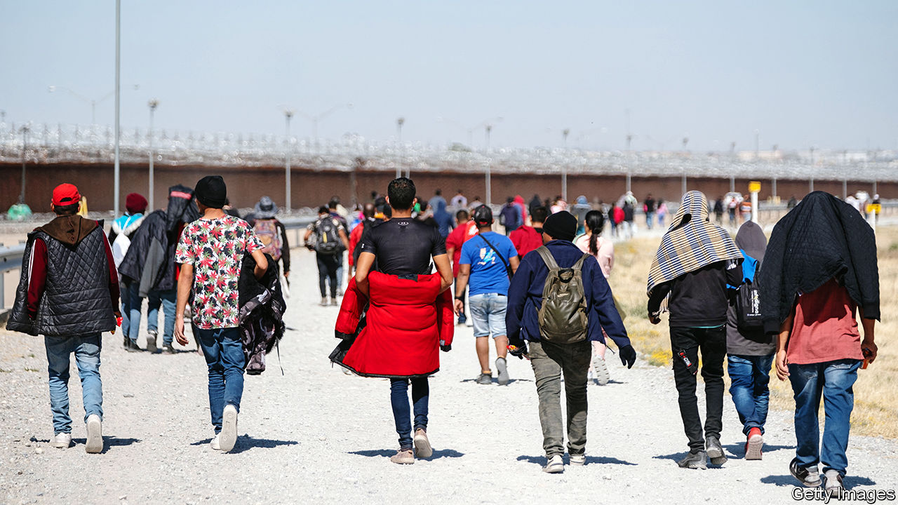

###### Cooler heads, calmer words

# How to detoxify the politics of migration 

##### Doom-mongers on both the left and the right are wrong 

 

> Dec 20th 2023 

Every day, screens around the world fill with grim pictures from , where nearly 2m Palestinians have been forced out of their homes. Even larger numbers have been displaced in Congo, Sudan, Syria and Ukraine. Most people feel compassion when they see fellow humans fleeing from bombs, bullets or machetes. But many also experience another emotion: fear.

Seen through a screen, the world can seem violent and scary even to residents of safe, rich places. Many worry that ever-swelling numbers of refugees and other migrants will surge across their borders. Nativist politicians talk of an “invasion”. 

Fear has curdled rich-world politics. A man who once advocated banning the Koran could be the . Britain’s Conservative Party is trampling on constitutional norms to try to send asylum-seekers on a one-way trip to Rwanda. Donald Trump tells hollering crowds that unlawful immigrants are “poisoning the blood of our country”.

Some perspective is in order. The vast majority of people who migrate do so voluntarily and without drama. For all the talk of record numbers and unprecedented crisis, the share of the world’s people who live outside their country of birth is just 3.6%; it has barely changed since 1960, when it was 3.1%. The numbers forcibly displaced fluctuate wildly, depending on how many wars are raging, but show no clear long-term upward trend. The total has risen alarmingly in the past decade or so, from 0.6% in 2012 to 1.4% in 2022. But this is only a sixth of what it was in the aftermath of the second world war. 

The notion that refugees pose a serious threat to rich countries is also far-fetched. Most fugitives from danger do not go far. Of the 110m people whom the UN classified as forcibly displaced as of mid-2023, more than half remained in their own countries. Barely 10% had made it to the rich world—slightly more than the population of London. This is not a trivial number, but it is plainly manageable if governments co-operate. Overall, poorer countries host nine times more displaced people with skimpier resources and less hysteria.

The populist right drums up fears of overwhelming numbers in order to win votes. Some on the left inflame the issue in different ways. Lavishing benefits on asylum-seekers while making it hard for them to work guarantees that they will be a burden, which is why Sweden’s anti-immigrant party now has a slice of power. Calling for the abolition of border controls, as some American radicals do, terrifies the median voter. Insisting that everyone should be defined by race and given a pecking order with the majority group ranked last, and then demanding that America admit millions more members of minority groups, is a recipe for ensuring Mr Trump’s re-election.

A wiser approach to migration would bear in mind two things. First, moving tends to make people much better off than they would have been, had they stayed put. Those who flee from danger find safety. Those who seek a new start find opportunity. Migrants from poor countries to rich ones vastly raise their own wages and have little or no effect on those of the native-born. Mobility also allows families to spread risks. Many pool cash to send a relative to a city or a richer country, so they have at least one income that doesn’t depend on the local weather. 

Second, recipient countries can benefit from immigration, especially if they manage it well. The most desirable destinations can attract the world’s most talented and enterprising people. Immigrants in America are nearly twice as likely to start a company as the native-born and four times likelier to win a Nobel science prize. Less-skilled migrants fill gaps in ageing labour forces and free up locals for more productive tasks (for example, when a foreign nanny enables two parents to work full-time).

A more mobile planet would be richer: by one estimate, completely free movement would double global GDP. These colossal gains remain unrealised because they would accrue mostly to the migrants, who cannot vote in the countries they want to move to. Still, rather than leaving all these trillions of dollars on the floor, wise governments should find ways to share some of them. That means persuading voters that migration can be orderly and legal, and proving that immigrants not only pay their way but enhance the collective good. 

So border security should be tight, while the slow process of denying or granting entry is streamlined. A realistic number of workers should be admitted—and selected primarily by market forces, such as visa auctions. Immigrants should be free to work—and pay taxes—but not to draw the same welfare benefits as citizens, at least for a while. Some day, the creaking global asylum system should be modernised and the task of offering sanctuary should be shared more fairly. A provisional EU deal announced on December 20th is a small step in the right direction.

Pessimists on the right argue that more migration will breed disorder, since people from alien cultures will not assimilate. Yet studies find no solid evidence that diverse countries are less stable—contrast homogeneous Somalia with many-hued Australia.

Pessimists on the left say the West will never let in many people or treat newcomers fairly because it is incorrigibly racist. Yet though racism persists, it has dwindled more than many people realise. When Barack Obama was born, mixed-race marriages were illegal in much of America, and many Brits still thought they had a right and a duty to rule other nations. Now a fifth of new American marriages are mixed, and Brits find it unremarkable that a descendant of colonial subjects is their prime minister. British Indians, Chinese-Canadians and Nigerian-Americans all earn more than their white compatriots, suggesting racism is not the main determinant of their life chances. 

Westward leading, still proceeding 

In the future, climate change may spur people to move more. But this will be gradual, and two forces may have the opposite effect. The shift from farms to cities—a much bigger mass movement than cross-border migration—will slow, as most of the world is already urban. And humanity will grow less mobile as it ages. Today, rich countries have a wonderful opportunity to import youth, brains and dynamism. It may not last for ever. ■

