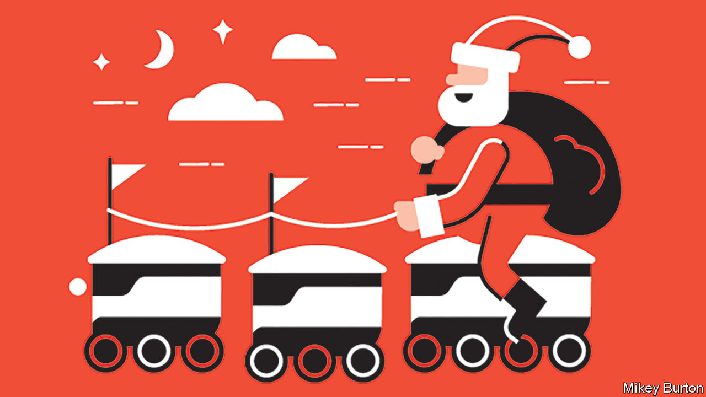

###### Santa tech

# Technology is helping Santa Claus come to town more efficiently 

##### A letter to shareholders of Father Christmas Global Inc 

 

> Dec 20th 2023 

DEAR SHAREHOLDERS of Father Christmas (FC) Global Inc, ’tis the season for management to update you on the state of the business. Growth in demand continues to be ho-ho-hum. That other implausible global delivery maestro, the stork, has been slacking, so our global customer base has expanded by just 130m infants this year, down from 144m in 2012, bringing the total addressable market to just over 2bn under-15-year-olds. We thus made 2023 the “year of efficiency”, like Meta but jollier. 

In particular, we invested heavily in our technological capabilities, to streamline operations, avoid supply-chain bottlenecks and contain costs. Start with logistics. We are ramping up use of ,  and . This provides a convenient way to put Donner, Blitzen and the rest of the herd out to pasture, while burnishing our ESG credentials by dispelling complaints about animal cruelty.

Satellite production sites near big population centres are being equipped with additive-manufacturing tools, popularly known as 3D printers. Like Alstom, a French maker of trains, which boasts of having printed 150,000 spare parts at its depots around the world, we are making our toy locomotives locally. This helps us avoid supply disruptions, such as those causing some competitors problems in the Red Sea. It will also help us avoid overstocking stocking-fillers. Our green footprint is benefiting from advances in the circular economy. Toys that end up broken by Twelfth Night—which in some years is most of them—are increasingly being recycled into raw materials for the 3D printers. 

Our new Santa App for iOS and Android offers computer-aided design software for fully customisable gifts. This took inspiration from the system launched in May by Nike for its trainers, and lets us make individualised items at little or no added cost. Forget scientist Barbie: we can do “irritating nine-year-old Jane Smith from Brighton” Barbie. Parents will love it. 

Technology is curbing other costs, starting with labour—a blessing in a time of worker shortages. Because 3D printers work autonomously, productivity per remaining pixie has surged. Shortages among service elves are being allayed with the help of ClausGPT, our proprietary chatbot. It can parse incoming correspondence and field complaints. Not loving little Jimmy’s new drum kit? We hope ClausGPT suggests earplugs, not violence.

Virtual AI avatars of Father Christmas reduce the strain on our chief executive. Ozempic, the hot obesity drug of 2023, reduces the strain on his health-insurance bill. It also lowers our key-man risk, which independent analysts now put below that for Elon Musk or Sam Altman.

To limit production costs, we have adopted the open-source RISC-V architecture for microchips, which these days feature in most of our products (and everybody else’s). This lets us avoid paying licence fees for semiconductors; Nvidia and its shareholders don’t need any more presents this year. With the promised phase-out of coal, just agreed at the un’s climate summit, the lumps for the badly behaved should become cheaper, too. Superbrats may even get two lumps.

In the spirit of Christmas disclosure, we wish to highlight a number of risks to our business. Some of our new technologies are dual-use, so government export controls threaten deployment. The spread of solar panels, already covering 4m residential roofs in our biggest market, America, is making landings treacherous. Efforts to insulate homes and substitute heat pumps for fireplaces are leading to access problems. 

Snow laughing matter 

And we cannot count on Amazon and Alibaba, our chief rivals, to remain on regulators’ naughty lists for ever. But we firmly believe that these risks are under control. In the worst-case scenario, we can always fall back on miracles. ■

