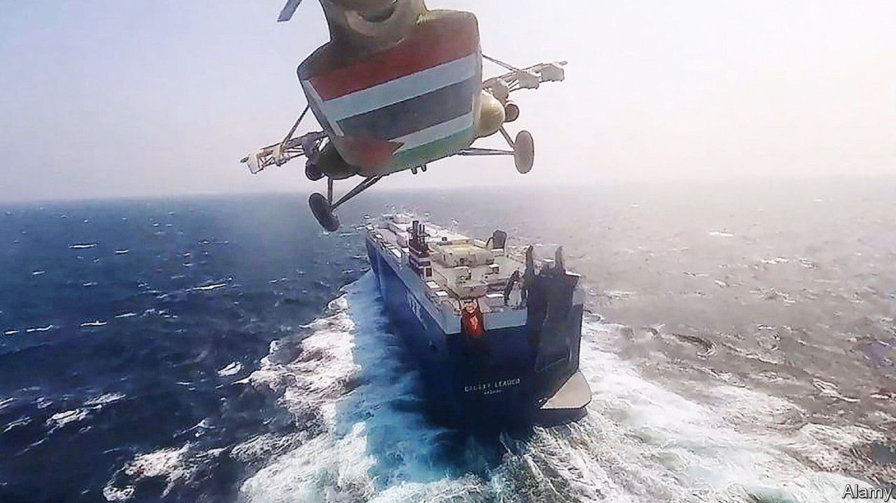

###### Maritime mayhem

# The US Navy confronts a new Suez crisis 

##### Houthi attacks on Red Sea shipping threaten global trade 

 

> Dec 19th 2023 


For the world to prosper, ships must reach their ports. They are most vulnerable when passing through narrow passages, such as the Strait of Malacca or the Panama Canal. So a recent surge of attacks on vessels in the Red Sea, the only southern conduit into the Suez Canal, poses a grave threat to global trade. , militants in Yemen backed by Iran, have fired over 100 drones and missiles at ships linked to more than 35 countries, ostensibly in . Their campaign is an affront to the principle of freedom of navigation, which is already at risk from the Black Sea to the South China Sea. America and its allies must deal firmly with it—without escalating the conflict in the Middle East.

A hefty 20% of global container volumes, 10% of seaborne trade and 8-10% of seaborne gas and oil pass through the Red Sea and Suez route. After weeks of mayhem four of the world’s five largest container-shipping firms have suspended voyages through it; bp has paused oil shipments. The effect on energy prices has been muted, owing to ample supply. But the share prices of container firms have soared, as investors anticipate a capacity squeeze. The cost to ship a container between Asia and Europe . If unresolved, the crisis will cause a supply-chain crunch.

The Houthis’ drone-and-missile stockpile, supplied by Iran, is the envy of many armies. They are one of the proxy forces Iran uses to attack Israeli, Gulf Arab and Western interests. In 2022 they launched multiple attacks on the facilities of Saudi Aramco, which is responsible for over 10% of global oil output. It is unprecedented for a militia in a failed state, whose motto promises “Death to America, Death to Israel”, to have ballistic missiles capable of flying 2,000km and hitting tankers.


American, British and French warships have spent weeks shooting drones and missiles out of the sky: on December 16th they took down 15. Yet this defensive approach is hard to sustain. Surface-to-air missiles costing millions of dollars are being used against a blizzard of cheap Iranian drones. Only a handful need to get through and ships and their insurers will stay away.

That points to a three-step approach. First, a bigger international naval presence in the Middle East. On December 18th America announced a new task force to patrol the area. Ten mostly Western countries have signed up publicly; nine others, including Egypt and Saudi Arabia, are thought to be helping more discreetly. Others, including India, which depends on Suez and has ships in the area, should come aboard.

At least five American destroyers are now in the Red Sea. The , an aircraft-carrier, is poised off Djibouti, its four squadrons of strike aircraft within range of Houthi territory. Its destroyer escorts have some 600 missile-launch tubes between them. For now the task force will play defence. One option is to provide armed escorts for merchant ships, as America did in the Gulf in the 1980s during the so-called tanker wars. But over time this requires too many warships. The task force is more likely to establish a safe corridor, with an air-defence bubble against drones and missiles.

That points to the second step: diplomacy. Saudi Arabia is on the cusp of a deal to extend a ceasefire with the Houthis which could end a war that has devastated Yemen for nine years. It could include commitments to end naval attacks. That might suit America, which is keen to dampen down regional tensions. Its navy is stretched and its carriers are sorely needed in Asia.

Yet diplomacy may fail and the Houthis may not respect any deal: they will surely find it tempting to hold global trade to ransom again. That is why, third, America and its allies must retain the option of strikes on the Houthis. Though malign and reckless, Iran surely does not want an all-out regional war and may be persuaded to rein in its client. But it should understand that if it fails to do so, retaliation against the Houthis is inevitable. ■

