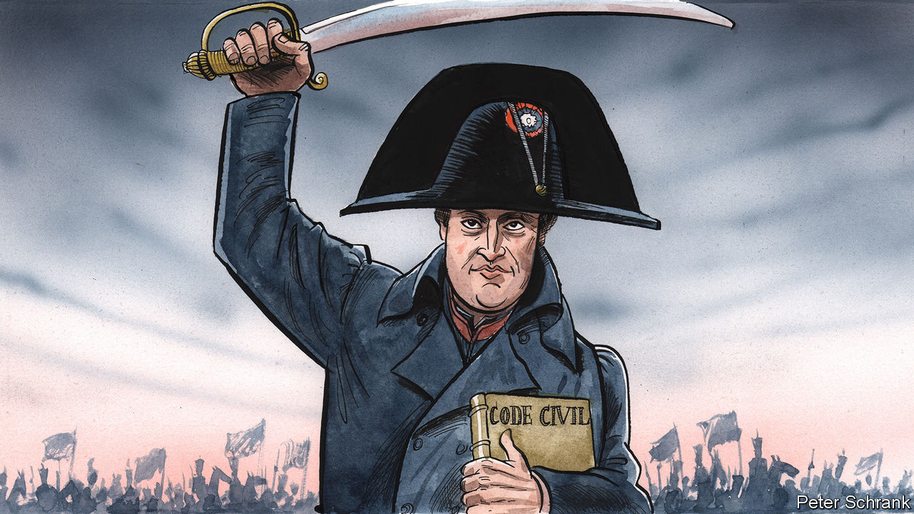
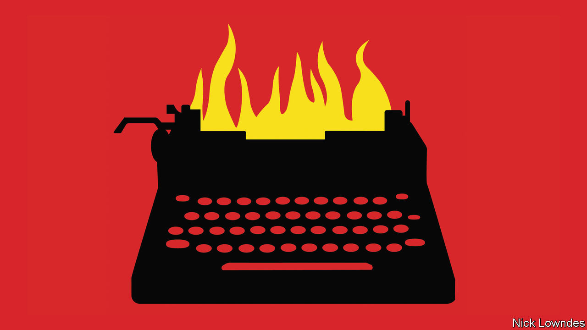

###### On investment in Europe, Napoleon, funeral cars, spy novels, euphemisms, flying lawn chairs

# Letters to the editor 

##### A selection of correspondence 

 

> Dec 20th 2023 


Capital markets in the EU

Your article on the state of the startup community in Europe (“”, December 9th) provided a welcome reminder of the promise of Europe’s tech entrepreneurs and Europe’s future competitiveness. As a businessperson, I wholeheartedly agree with your conclusion: the best thing the European Union can do to support the startup and scaleup community is to move away from digital-specific regulation and focus more on creating a truly single market. The single market is our best tool to strengthen European competitiveness, especially in a world of severe competition from America and China. 

By the European Commission’s own estimate, completing the single market would deliver a budget-neutral boost in growth of over €700bn ($767bn) between now and 2030. Hopefully, the forthcoming proposal from Enrico Letta, a former Italian prime minister, to strengthen the single market will receive the political attention and investment it so desperately needs. Aside from easing access to national markets of the EU, consider how a deeper single market would also enable scaleup by facilitating better access to investment funding.

EU capital markets have shown some growth year on year since 2015. In some countries, they are moving in the right direction, but the harmonised EU push is not there. Not least because of the fragmentation of national capital markets, which hinders integration at an EU level.

A well-functioning European capital market would be transformative, allowing small- and medium-sized business to grow, companies and people to invest, citizens to cater for their financial needs and investments to be carried out where they are needed the most. The potential positive externalities in terms of competitiveness, trade and security are self-evident. 

For all these reasons, the EU capital markets union, launched in 2015, needs to materialise. Leaders at both the national and EU level need to move beyond lip service and invest the political capital needed to make it happen. 

Jacob Wallenberg

Chair

Investor AB


 


Napoleon by the numbers

Charlemagne stated that Napoleon killed millions and, adjusted for population, “that is perhaps no less murderous than an Adolf Hitler or Joseph Stalin” (). There are actually huge differences behind the numbers. The French revolutionary and Napoleonic wars resulted in an estimated 3.5m to 4m deaths, including up to 1m civilians, over a period of some 25 years. Not all of those deaths can be attributed to the  or to Napoleon personally, since the first round of warfare was initiated by the countries opposed to the French revolution. But certainly a large percentage of that total was the consequence of Napoleon’s actions and policies attempting to secure French dominance of Europe through military conquest following his assumption of power.

The laws that governed the conduct of war were rudimentary by contemporary standards, but those rules that existed were mostly observed by all the major participants in the Napoleonic wars. 

The French revolutionary wars were much less destructive than either the second world war or the mass starvation and oppression of the Stalinist regime. Out of a population of approximately 187m people in Europe and Russia in 1800 the estimated 4m deaths in the Napoleonic and revolutionary wars between 1790 and 1815 represent about 2% of the population. In the second world war around 40m to 45m perished in the European theatre of the conflict, including the Soviet Union. That represents approximately 9% of the total population of Europe, including the European part of the Soviet Union, of around 485m people at that time. Stalin’s policies resulted in the deaths of an estimated 20m people, most of whom died between 1930 and 1941. That is 12.5% of the Soviet population. 

There is no comparison between Napoleon and the genocidal and mass-atrocity policies of Hitler and Stalin.

Dr T.D. Gill

Emeritus professor of military law

University of Amsterdam

One often neglected area of Napoleon’s legacy is his sale of the Louisiana Territory to the fledgling United States. Because of that America could expand westward without fighting France. In 1898, Bismarck purportedly said that the most decisive event in modern history was the spread of English in North America, which was helped by Napoleon’s decision to sell off land stretching from Louisiana to Montana. 

James Horton


Death and the divas

Art galleries hosting supper clubs (“”, November 18th) demonstrates the same rational management of under-utilised assets that was used decades ago by Steve Ross, who later became Time Warner’s boss. In the 1950s he convinced his father-in-law, who owned the largest funeral home in America, to lease his fleet of limousines for night-time use by Manhattan’s high-rollers. The only catch was they had to ensure the cars were returned in time for the next day’s funerals.

Ira Sohn

Emeritus professor of economics and finance

Montclair State University


 


Some Christmas reading

As a long-time devotee of spy novels I found no fault with your list of eight of the best (, November 24th). Except, perhaps, the fault of omission. Any list of the best spy fiction should include something from the Ashendon stories by W. Somerset Maugham. As with John le Carré and Graham Greene, Maugham knew of what he spoke, having served in the Secret Service and basing the spymaster “R” on Sir John Wallinger, who recruited him. 

Also, the Bernard Samson books by Len Deighton have no peer in terms of the consistent development of multiple characters through time periods and events. Both Maugham and Mr Deighton make delightful use of the ambiguities of the profession to weave compelling tales. 

Stephen Gash


 


Long-winded opinions

Johnson’s column on euphemism and exaggeration in language () reminded me of a quote from C.S. Lewis’s “Studies in Words”: “the greatest cause of verbicide is the fact that most people are obviously far more anxious to express their approval or disapproval of things than to describe them.”

Joshua Tomlinson


Oh what fun it is to ride…

It was great to see “Lawnchair Larry” Walters recognised for his achievement of using weather balloons to take flight in a garden chair (, November 25th). The feat earned him a spoof Darwin Award, which is normally given on behalf of the human race to those who accidentally select out of the gene pool during the spectacular climax of a great idea gone very, very wrong. Luckily Walters did not die, and the award was changed to a special “most at risk survivor”. 

Chris Drake


