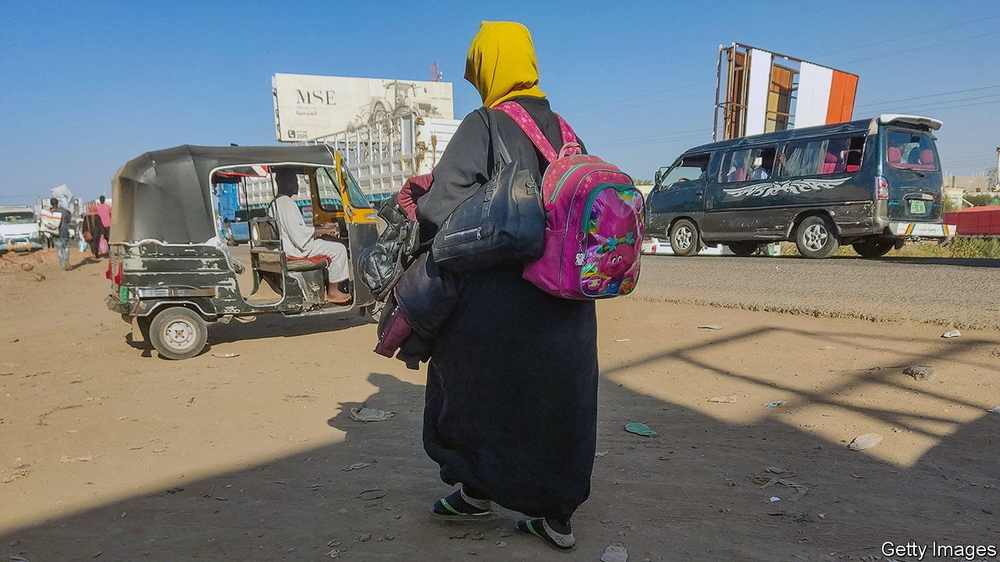
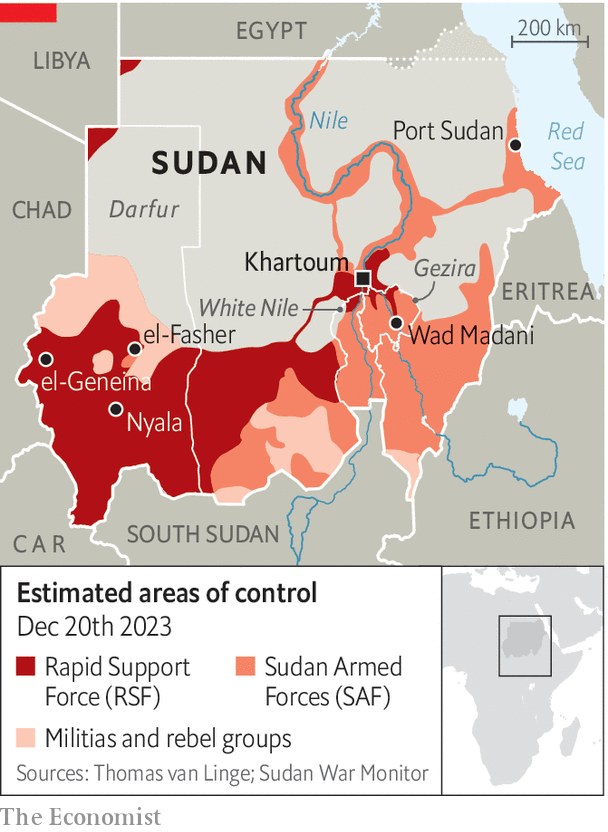

###### A nightmare within a nightmare

# A supposed haven in Sudan falls to a genocidal militia 

##### The worse of two bad factions is winning the war 

 

> Dec 20th 2023 

The gunfire on the outskirts of Wad Madani, one of Sudan’s biggest cities, began at dawn on December 15th. Panicked civilians began to flee. The attack by fighters from the Rapid Support Forces (rsf), a paramilitary force, was met with air strikes by the Sudanese Armed Forces (saf), the regular army. After a brief lull in which the saf claimed victory, gun-toting militiamen then stormed into the city centre. As they did so, saf soldiers abandoned their posts and slunk away to the south.

The fall of Wad Madani, about 200km south-east of Khartoum, the capital, comes five years after pro-democracy street protests erupted that eventually forced out Sudan’s long-time dictator, Omar al-Bashir. But Sudan’s political transition was derailed in 2021 by a coup staged jointly by the rsf and the saf. In April their edgy alliance collapsed into civil war. Some 7m people have been displaced within Sudan. Another 1.4m have fled to neighbouring countries, many to Chad, after genocidal violence against the Masalit, a black African tribe, by the rsf and allied militias. 

 


The latest fighting is worsening a humanitarian catastrophe. As many as 300,000 people have fled Gezira state, of which Wad Madani is the capital, in just four days, the UN estimates. Many are fleeing for a second time, since nearly 500,000 people had escaped there, mostly from bloody chaos in Khartoum. Cities farther south, where they may now flee, may not be safer for long. Those remaining in Wad Madani fear atrocities by the rsf, which has a record of carrying out massacres and rapes, and air raids by the saf. 

Wad Madani was also an important staging-point for sending aid and was one of Sudan’s few remaining medical hubs. No longer. Scores of badly disabled babies who had been relocated from Khartoum after their orphanage had been caught in the fighting are again in desperate need. 

The city had been considered an saf stronghold. That it fell so swiftly piles the pressure on General Abdel Fattah al-Burhan, the SAF’s head. After the city’s fall, rumours swirled of a coup against him, which the saf seemingly sought to deny. Instead the saf announced an investigation into why its troops fled the city. 

In fact the army has been in retreat for months. General Burhan himself left Khartoum for Port Sudan, in the north-east, while the rsf seized control of most of the big cities in Darfur, in the west. “saf has essentially not won a major battle of this war,” explains Alan Boswell of Crisis Group, a think-tank, who is based in Nairobi. One reason for the rsf’s success is backing from the United Arab Emirates (uae), which has reportedly been shipping weapons to it via Chad. (The uae denies this.) Egypt, which General Burhan hoped would prop up his side, has failed to keep pace, in part as a result of its own mounting economic woes. 

Many worry Sudan could end up like Libya, split into chunks controlled by rival factions. It could get even worse. The rsf may try to seize much more of the country, perhaps all of it. What may be left standing in Sudan is unclear, cautions Mr Boswell. The rsf’s next move may be to try to seize all the major southern cities.

Still, the rsf could get bogged down in the south. And the saf is not its only rival. In November many feared a big battle for el-Fasher, the capital of North Darfur state. That has not yet materialised, despite some skirmishes, in part because other former rebel groups announced that they would defend the city from the rsf. 

Diplomacy has plainly foundered. On December 9th a regional summit failed again. Talks may have a chance if the rsf gets stuck or if it surges dramatically forward and the SAF is forced to sue for peace. Even then, a deal would be hard to strike. Western governments have been distracted by crises elsewhere. Regional ones have been just as ineffective. “There hasn’t been a major ceasefire push since the first few weeks of the war,” laments Mr Boswell. “It’s been a giant mess.” ■

