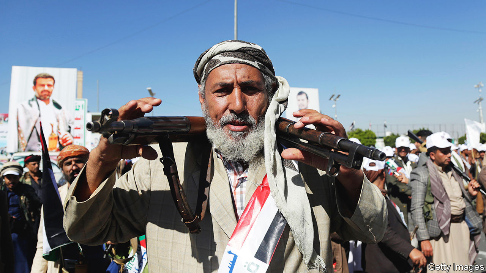
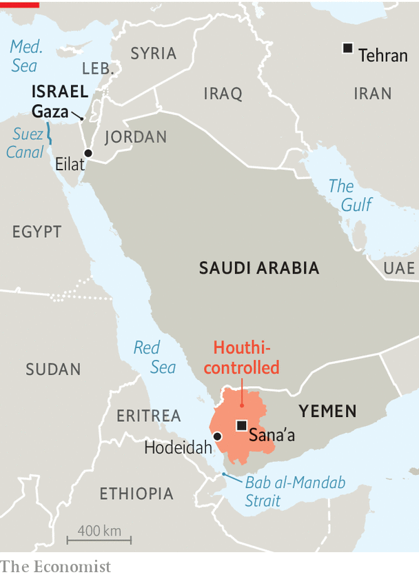

###### Piracy and peace

# Attacks on shipping threaten to upend peace talks in Yemen 

##### The Saudis want to end their war with the Houthis, even as America may fight them 

 

> Dec 19th 2023 

NOT LONG ago the Saudis might have welcomed a Western show of force against the , a Shia rebel group that has fought against a Saudi-led coalition in Yemen since 2015. Yet today, as America forms its own coalition to stop Houthi attacks on commercial shipping, it is the Saudis urging caution: they fear efforts to escape their war in Yemen could be spoilt.

Since mid-November the Houthis have attacked at least a dozen vessels in the Red Sea, either by firing missiles and drones, or by attempting to hijack them. Stirred up by the war in Gaza, the group claims it targets ships with ties to Israel. But its attacks seem increasingly random. One missile strike in December hit a Norwegian-flagged, Indian-crewed tanker carrying vegetable oil from Malaysia to Italy.

 


Many firms have decided to avoid the area. Since December 15th, four of the five largest shipping companies—CMA CGM, Hapag-Lloyd, Maersk and MSC—have  through the Red Sea. On December 18th BP, a British oil-and-gas giant, said its tankers would avoid the route. Insurance costs have soared. This will have sharp consequences for the world economy: about 10% of seaborne trade passes through Bab al-Mandab, a narrow strait between Africa and the Arabian peninsula.

It will particularly hurt Egypt, which collected a record $9.4bn in revenues from the Suez Canal in the fiscal year to June 30th. Those fees are one of its main sources of hard currency. The government has tried to play down the impact of the Houthi attacks. Osama Rabie, the head of the Suez Canal Authority, says that only 55 vessels diverted their course between November 19th and December 17th, compared with 2,128 that passed through the canal. But that mostly reflects a time before big shippers started to avoid the Red Sea. Next month’s figures will probably be worse.

The Houthis have received arms and training from Iran, and their campaign against shipping fits a broader Iranian strategy of using its proxies to hamper Israel. But Western and Israeli officials are not sure Iran is directing individual attacks. American officials say they are keen for China to play a diplomatic role. They hope it will urge Iran to rein in the Houthis. China is the largest buyer of , taking nearly 1.5m barrels a day (nearly half of its total output), which gives it leverage in Tehran; and it needs safe passage through the Red Sea for trade with Europe.

A multinational task force led by America’s navy is already operating off the Yemeni coast to try to deter the Houthis. In recent weeks American, British and French warships have all intercepted Houthi drones and missiles. This is making the Saudis nervous. After the Houthis seized Sana’a, Yemen’s capital, and much of western Yemen in 2014, a Saudi-led coalition invaded to remove them from power and restore the internationally recognised government. The war became a quagmire. The Houthis still control most of Yemen’s population, while secessionist rebels, backed by the United Arab Emirates (UAE), hold sway across the south.

The Saudis have been desperate to end their role in the war (the UAE withdrew most of its troops in 2019). They agreed to a two-month truce with the Houthis in April 2022 and then extended it twice. Though the truce ended officially in October 2022, it remains largely in effect: violence in Yemen is well below pre-truce levels. Both sides have spent months talking about a peace deal, and the Saudis have offered a few gestures to the Houthis, such as easing their naval blockade of Yemen and allowing more flights into Sana’a.

Diplomats say the parties are now close to agreeing on a “road map” to make the ceasefire permanent and end the war. Hans Grundberg, the UN’s Yemen envoy, is shuttling between them to finalise the details. The first phase would probably focus on economic measures. The Houthis have long demanded that the internationally recognised government pay public-sector salaries in areas they control, something the Saudis have refused to allow. Under a new road map, which could be announced in the next few weeks, the kingdom would probably permit such payments.

That puts Saudi Arabia in the awkward position of urging American restraint against its old foe. The kingdom seethed when Joe Biden decided in 2021 to remove the Houthis from America’s list of foreign terrorist organisations. But now, as members of Congress urge the Biden administration to reverse its decision, the Saudis are quiet. Western officials say putting the Houthis back on the list would shred the road map: for example, the Saudis could not facilitate salary payments to a group under blanket American sanctions. 

The Houthis hope that their attacks on shipping will give them more leverage in talks with Saudi Arabia, and that fighting on behalf of the Palestinians will boost their popularity in Yemen. They may be right about the former—but the latter could prove a miscalculation. Their campaign has undeniably had an impact on Israel. Revenue at the Israeli port of Eilat is down 80%, and the cost of shipping goods to Israel is rising. But Eilat handles only around 5% of Israel’s seaborne trade; most of it goes through Ashdod and Haifa on the Mediterranean. The Houthis will raise costs for Israeli consumers, but they are far from placing the country under siege.

The consequences could be much worse in Yemen, which imports more than 80% of its food. Most of that comes through Hodeidah, its main Red Sea port. Ships will now either avoid calling there or charge higher prices to reflect their own soaring cost of insurance. One Yemeni businessman says his freight rates have increased by more than 50% since the Houthis started their attacks.

That will mean higher food prices in a country where most people already cannot afford to eat: the price of a basket of staple foods in Yemen has increased fourfold over the past five years. Around two-thirds of Yemenis rely on aid to survive. The Houthis are not so much blockading Israel, in other words, as they are blockading their own desperately poor country. ■

