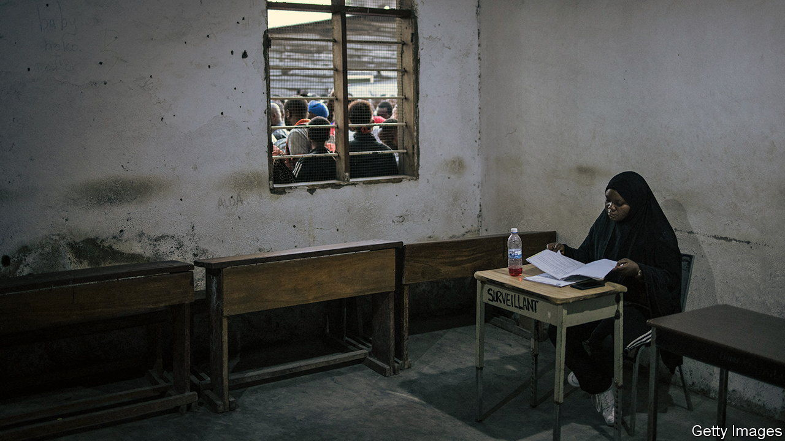
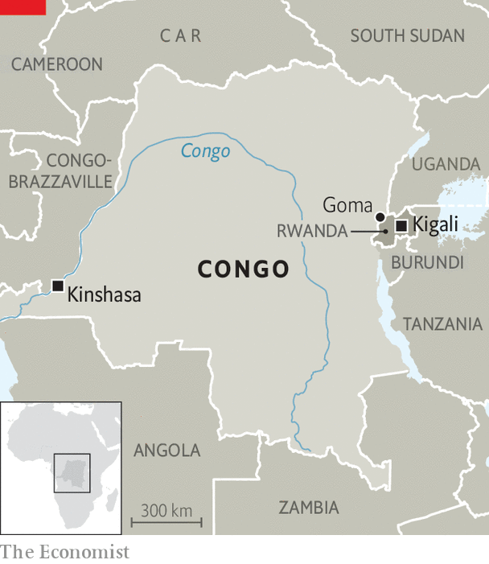

###### A barely governable country

# For Congo’s next president, winning may be the easy part 

##### Whoever it is, a staggeringly hard task beckons 

 

> Dec 20th 2023 

On December 20th, as  went to press, millions of Congolese were queuing to vote. The much-criticised electoral commission will probably claim that the very fact of holding a general election on time in a country four times the size of France should itself be considered a triumph. Yet as Moïse Katumbi, a leading opposition candidate, angrily puts it: “Which type of election?”

Some 1.7m voters in the east will not cast a ballot because of conflict there. Many others elsewhere may be disfranchised. Crucial papers for reporting the results across the 75,000 polling stations arrived so late in Kinshasa, the capital, that the government had to beg the UN peacekeepers it has spent years scapegoating and other countries such as Angola and Egypt to provide planes to fly the papers around the country. The illegibility of millions of voter cards will add to the chaos. Though the results are almost certain to be disputed, the president is meant to be sworn in on January 20th. 

 


Whether it is Félix Tshisekedi, the incumbent, or one of his opponents, he (not she) will face a monumental task. After nearly three decades of war in the east, some 7m people are displaced. Under the guise of chasing former perpetrators of the genocide of 1994, Rwanda has been backing the M23, a rebel group in eastern Congo, where it has also sent troops (Rwanda denies both accusations). So a first urgent question for the incoming president will be what to do about Rwanda. The M23 is only about 30km from Goma, a big eastern city. America, worried that a proxy war could turn into a brutal direct one, recently brokered a temporary ceasefire which it hopes to turn into longer peace talks. 

Yet the politics of peace is extraordinarily complicated—and getting more so. To widespread astonishment a new political-military alliance was recently announced between the M23 and Corneille Nangaa, who headed Congo’s electoral commission at the 2018 election. Back then, he declared Mr Tshisekedi the winner despite leaked official data suggesting that another opposition candidate, Martin Fayulu, had won handsomely. 

Peace talks have failed in the past. Even if a deal is struck between Congo and Rwanda, strife in the east could persist. A dizzying array of other armed groups operate there, including one linked to Islamic State. To secure a broader peace, the new man must decide whom to rely on for help. 

Long-deployed UN peacekeepers are slowly leaving. So is an ineffective east African regional force, in theory to be replaced by one from southern Africa. Soldiers from Uganda and Burundi have also been operating in Congo under bilateral agreements but that may complicate matters. “You think you’ve got Rwanda and Congo fixed up, but then Uganda is a really important element…and then you’ve got Burundi,” sighs a Western diplomat. 

Adding to the mix of men with guns are the , Swahili for patriots, a mishmash of government-backed militias with a record of bloody mayhem whom Mr Tshisekedi nonetheless calls heroes. Some 1,000 Romanian mercenaries also operate in the east. Mr Tshisekedi insists they are instructing his army, not directly fighting. 

Improving the economy is the new president’s second tough task. Despite strong growth thanks to high mineral prices, the number of Congolese living in extreme poverty, some 60m in a population of 100m or so, has been rising. How to make the mining boom improve wages and pay for roads and hospitals rather than go on chandeliers and filling politicians’ bank accounts? One hope, shared by Mr Tshisekedi and Mr Katumbi, is to process more minerals within Congo itself. But that would require reliable cheap electricity in a country where about 80% of the people have none at all. The perennial hope is the Grand Inga Dam, a huge hydropower scheme, but Nicolas Kazadi, the country’s finance minister, admits that the project does not even have a timeline. 

Many hope for real action on another pervasive problem: corruption. In July the government suspended the licence of the country’s first gold refinery just days before it was to start producing, saying it did not respect its “societal obligations”. Around the same time the government expanded its own gold joint venture with Primera Group, based in the United Arab Emirates, where the gold is refined. The government denies any wrongdoing.

Many Congolese bigwigs operate in a web of facilitation fees and patronage. The country must redefine more tightly the meaning of corruption, says Willy Mulamba, who chairs Congo’s banking association. The faith of young people in politics and democracy has been savagely eroded. “For years we’ve been in the same mess,” complains Shishi, a Congolese rapper. “People come to us and say ‘We’re going to change this country’,” he explains. “But they’ve lied to us a lot.” ■

