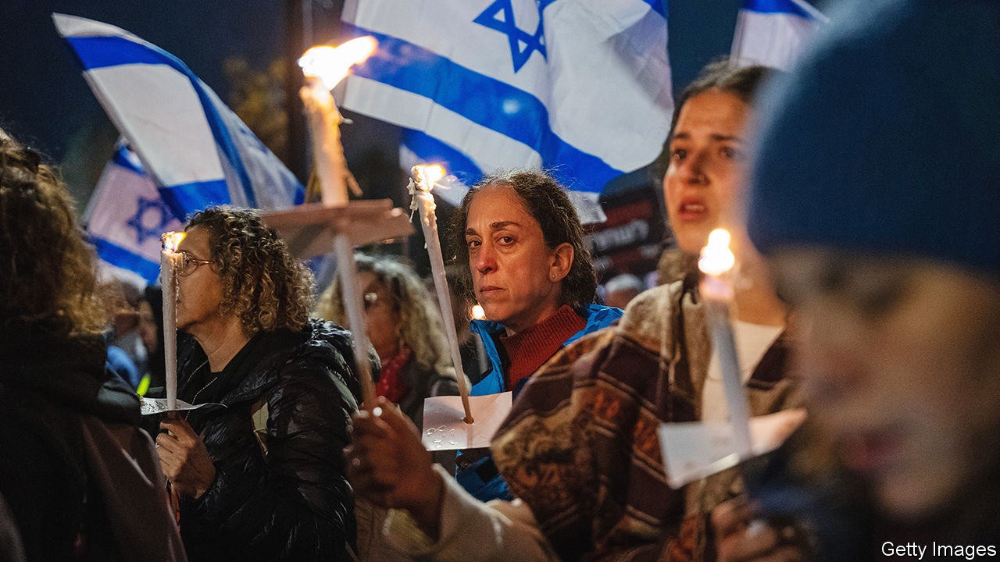

###### Hostage to hell

# Israel isn’t sure what to do about the hostages in Gaza 

##### Every option is fraught with danger 

 

> Dec 20th 2023 

The deaths on December 15th of three Israeli hostages in Gaza, who were misidentified as members of Hamas and shot by Israeli soldiers, highlights how Israel’s dilemmas in reconciling its objectives in its war with Hamas are growing ever more acute. To the desperate families of the remaining hostages it seems clear that their loved ones may pay the ultimate price. 

After Hamas’s attack on October 7th, Israel vowed to demolish the Islamist movement militarily, end its rule over the Gaza Strip and rescue 240-plus hostages taken by Hamas and other Palestinian groups. Since then, the Israel Defence Forces (idf) has dropped tens of thousands of bombs onto the territory and sent over four divisions of troops into the coastal enclave.


Yet only one hostage has been safely recaptured as the result of an Israeli raid. Around 130 are still being held. Finding and freeing them in a war-zone where around 20,000 Palestinians—a majority of them civilians—have been killed is proving impossible. Nearly half were released in a prisoner exchange during a truce in late November. But Hamas is demanding the release of many more of its own prisoners in Israel and a much longer ceasefire if it is to free any other hostages. 

The Israeli government’s position on further negotiations over hostages looks confused. Binyamin Netanyahu, the prime minister, at first ruled out resuming the Qatari-brokered talks with Hamas. He also stopped David Barnea, the head of Mossad, the intelligence agency, who is also Israel’s main negotiator, from flying to Doha, Qatar’s capital. But two days later Mr Barnea met Qatar’s prime minister in Europe. 

For the moment Israel is resisting pressure for another ceasefire. The idf says it needs more time to destroy Hamas’s extensive tunnel network under Gaza, where many militants are still hiding. The far-right parties in Mr Netanyahu’s coalition are adamantly opposed to another truce. 

But Israel’s other war aims look increasingly muddled, too. Mr Netanyahu insists in public that “Gaza will neither be Hamastan nor Fatahstan”: the latter refers to the group that runs the Palestinian Authority in the West Bank. Yet puzzle-solvers in the Israeli government have been discussing—albeit unofficially—alternative ideas for Gaza’s post-war future which do involve Fatah and the Palestinian Authority. 

It is also unclear how Israel plans to provide basic aid to the 2m-plus Palestinians trapped in Gaza. “If the idf is to continue its campaign against Hamas in Gaza, there has to be a serious plan for taking care of the humanitarian needs there as well,” says an exasperated Israeli security official. “But the political paralysis means this is happening too slowly.”

Immediately after the massacre of Israelis on October 7th, the government declared that it would not let any supplies enter Gaza from Israel. Aid would have to go through Egypt. Some food, water and medicine would be allowed in, but no fuel. 

Since then, fuel has begun to trickle in. On December 17th Israel’s cargo-terminal with Gaza at Kerem Shalom was reopened. Before the war around two-thirds of shipments into Gaza passed through this crossing. Opening it has increased the capacity for sending desperately needed supplies, but Israel is still insisting that any aid comes on a circuitous route via Egypt, rather than directly through Israel, which is much quicker and more efficient.

Among Israel’s Western allies, Britain, France and Germany are now pushing for a ceasefire. On December 17th the British and German foreign ministers called for a “sustainable” one, but did not suggest a date and accepted Israel’s view that Hamas should not be allowed to run Gaza. 

Pressure from Israel’s key ally, America, to end the war is still mainly behind the scenes. But Mr Netanyahu is increasingly frank about his rift with the Americans. He presents himself as a defiant defender of Israel’s interests, hoping to shore up his shrinking nationalist base and keep his far-right partners on board. But his focus on his own political survival at the expense of a coherent plan for Gaza means the fate of both Israeli hostages and Palestinian civilians in Gaza looks bleak. ■

