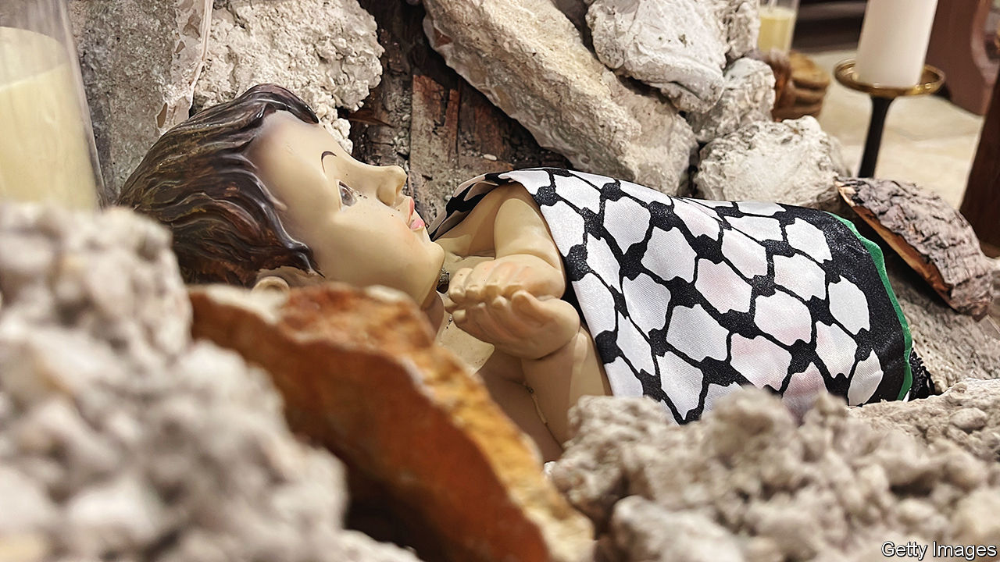

###### Cancelling Christmas in the Holy Land

# The plight of Christians in Bethlehem and Jerusalem predates the latest Gaza war 

##### Their number is continuing to dwindle 

 

> Dec 20th 2023 

This year’s nativity scene in Bethlehem depicts a baby swaddled in a Palestinian (a chequered headdress) resting on a heap of rubble. It is hard to spot the wise men, frankincense, or myrrh. The war in Gaza has prompted a drastic scaling back of celebrations in the West Bank. No banquets, no traditional parades of Boy Scouts, no pilgrims. Bethlehem is silent. Christmas in the land where Jesus Christ was born has, in effect, been cancelled.

Gaza’s dwindling community of Palestinian Christians has been hard hit since October 7th. At least 16 were killed in an air raid that damaged the church of St Porphyrius, Gaza city’s oldest. Pope Francis called Israel’s actions in Gaza “terrorism” after a Christian mother and daughter were shot dead as they sheltered in a church compound. Church leaders say half of Gaza’s Christians have fled since the war began.


Instead of Christmas carols, barber shops in Jerusalem’s Christian quarter are blaring out non-stop coverage of the horrors in Gaza on the Al Jazeera TV channel. “No one is in the mood for celebrating,” says Munther Isaac, pastor of Bethlehem’s Lutheran church. “But maybe we are praying even more.”

Even before the latest war the fortunes of Christians in the West Bank, including Jerusalem, were fast declining. Gaining permits from the Israeli authorities to travel in and out of Bethlehem and Jerusalem is unpredictable, even for the clergy. Moreover, say Christians, a violent Jewish settler movement is bullying them more and more—with impunity. Cut off from Jerusalem by Israel’s separation wall and by a string of settlements, Bethlehem is isolated.

Jewish settlers in the Arab eastern side of the old city of Jerusalem are only about a thousand strong. But they have become more aggressive and are implanting themselves more strategically to isolate both Christian and Muslim Palestinians in the city and its vicinity.

Meanwhile the Armenian community is fighting what it says is an “existential battle” to keep part of its domain in the old city. A land deal with an Israeli developer “puts the Armenian presence and Christian presence in Jerusalem in danger”, says the Armenian patriarchate. Bulldozers have already moved in. 

Yousef Daher of the World Council of Churches in Jerusalem explains that if a Palestinian Christian in Jerusalem marries a West Banker, the spouse cannot live in the city without a permit that can take a decade to get. But if the couple move to the West Bank, any residency rights in Jerusalem may be forfeited. Before the war in 1967, some 24,000 Christians lived in the city. Now there are only 9,000.

“The mindset in Israel is that Jerusalem is ours,” says Daniel Seidemann, an Israeli lawyer and expert on the city. “It’s the most serious crisis since 1948.” The exodus of Palestinian Christians looks unlikely to be reversed, he suggests: “You’ll probably find more Jerusalem Christians living in Illinois or Michigan than in East Jerusalem.”■

