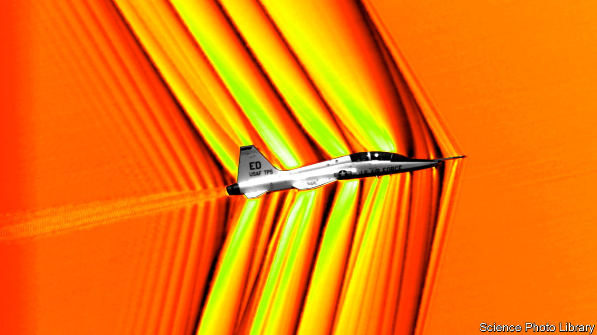
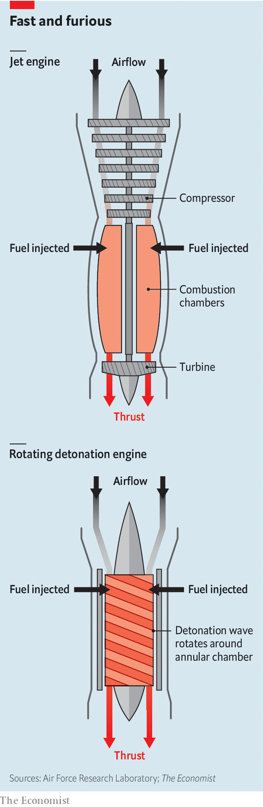

###### Flying in a flash

# A new type of jet engine could revive supersonic air travel 

##### It would also be simpler and more fuel-efficient 

 

> Dec 19th 2023 

Since the 1960s engineers around the world have been fiddling with a novel type of jet called a rotating detonation engine (RDE), but it has never got beyond the experimental stage. That could be about to change. GE Aerospace, one of the world’s biggest producers of jet engines, recently announced it was developing a working version. Earlier this year America’s Defence Advanced Research Projects Agency awarded a $29m contract to Raytheon, part of RTX, another big aerospace group, to develop an RDE called Gambit.

Both engines would be used to propel missiles, overcoming the range and speed limitations of current propulsion systems, including rockets and existing types of jet engines. However, if the companies are successful in getting them to work, RDEs might have a much broader role in aviation—including the possibility of helping revive supersonic air travel.

In a nutshell, an RDE “replaces fire with a controlled explosion”, explains Kareem Ahmed, an expert in advanced aerospace engines at the University of Central Florida. In technical terms, this is because a jet engine relies on the combustion of oxygen and fuel, which is a subsonic reaction that scientists call deflagration. Detonation, by comparison, is a high-energy explosion that takes place at supersonic speeds. As a result it is a more powerful and potentially a more efficient way of producing thrust, the force that drives an aircraft forward.

 


A conventional jet engine uses lots of moving parts (see diagram). Rotating blades draw in air and compress it before igniting it with fuel in a combustion chamber, creating rapidly expanding hot gases that blast out of the rear. As the gases exit they drive a turbine, which keeps the whole process going. An RDE is simpler. Air entering the front is forced into a hollow space between two concentric cylinders. When fuel is pumped into this area, it mixes with the oxygen in the air and detonates, creating a rotating supersonic shock wave that spirals around the gap and out of the rear. Once it has started, the detonation is self-sustaining. 

Some jet derivatives, such as ramjets and pulse jets, also work without compressors and turbines, but they operate differently and have limitations. Being simple and compact, an RDE would be cheap to make and fuel efficient, allowing missiles to fly farther and faster, at up to five times the speed of sound (Mach 5, or some 6,125kph). The GE version is designed to be used with a ramjet to accelerate hypersonic missiles, which fly faster than Mach 5. 

For a long time engineers had lacked the tools to build RDEs. That changed with advances in computer modelling, new alloys that can resist extreme temperatures and additive manufacturing, known as 3D printing. In 2020 Dr Ahmed and his colleagues made an experimental rocket version for launching space missions. 

To power an aircraft an RDE would probably require assistance in taking off until sufficient air was being forced into the engine for detonation to begin. There is, though, a precedent for how this might be done using a hybrid engine. The Lockheed SR-71 Blackbird, a high-altitude American spy plane flown during the cold war, was powered by a pair of conventional jet engines. It would reach supersonic speeds the way most fast jets do, by lighting up its afterburners. This involves pumping fuel into the engines’ exhausts to create additional thrust. At about Mach 2, some of the air entering the front of the engines was piped directly to the back to be combusted in the afterburners, pushing the Blackbird to more than Mach 3. Some sort of arrangement incorporating an RDE into a conventional jet should be possible.

An RDE would guzzle less fuel than an afterburner, but it might be as rowdy. This is not necessarily a big problem for the military, but it is for civilian use. Hence Concorde, the world’s first and only commercial supersonic airliner, was expensive to operate and was banned from many routes for being too noisy. Since Concorde, which could fly at just over Mach 2, was retired from service in 2003, various groups have looked at building a replacement. Boom, a firm based in Colorado, is preparing to test fly a small prototype soon. If successful, the firm will build an 80-seater aircraft called Overture, capable of Mach 1.7. Boom claims it will be able to do this more economically and quietly than Concorde using conventional jets with specially designed intakes and exhaust nozzles, which avoid the need for afterburners.

Boom, boom

A RDE might similarly be toned down a bit with modern design techniques. But dealing with the inevitable sonic boom which trails behind an aircraft travelling faster than the speed of sound is another matter. Researchers believe that too could be reduced, but not completely muffled. By modifying an aircraft’s fuselage and wings, engineers believe they can reduce the boom’s impact on the ground below. Such work will help to determine whether or not future supersonic passenger planes will, like Concorde, be restricted to flying beyond the speed of sound only over oceans. 

Air travel owes much to military technology, but it can take a long time to transfer. Jet engines first appeared in the 1940s on fighter planes, but it took until the late 1950s before they began to replace propeller-driven airliners in any great number. So passengers hoping to cut the subsonic seven-hour red-eye flight from New York to London to a little over an hour might have to wait a decade or more. ■


