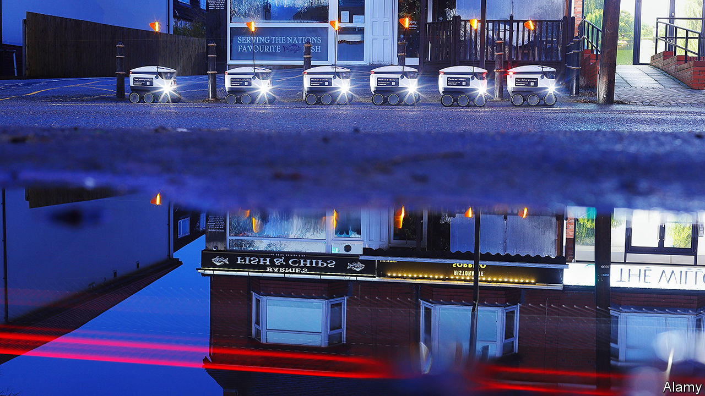

###### Robotics

# Delivery robots will transform Christmas 

##### Santa’s hi-tech little helpers 

 

> Dec 18th 2023 

A shop assistant leaves a Co-op convenience store in Milton Keynes and opens the lid of a white box, about the size of a small suitcase, with a red flag on top and six wheels. After the assistant drops a bag of shopping inside and scans a bar code, the box trundles off. Travelling at a brisk walking pace along the footpath, it pauses at a road junction until two cars have passed before crossing safely. Neither pedestrians nor car drivers give it a second glance. Delivery robots like this have become part of the scenery since they started work in this town, some 80km north-west of London, in 2018.

“That’s when you know a new technology is successful,” says Ed Lovelock. “People don’t notice it any more.” Mr Lovelock is product manager for Starship Technologies, a Californian firm that has so far delivered more than 5m shopping orders and restaurant meals in Europe and America using its autonomous Starships. 

In some places such deliveries arrive by air. “It soon becomes a normal part of your life,” says Keller Rinaudo Cliffton, the boss of Zipline, a drone-delivery firm also based in California. Zipline began using drones to deliver blood and medical products in Rwanda in 2016. It is expanding into groceries and meals and now operates in other parts of Africa as well as America and Japan. In 2024 Zipline will begin deliveries to hospitals and clinics in the north of England for Britain’s National Heath Service. 

Where’s my bot?

Like many new technologies, delivery bots have gone through something of a hype cycle. A decade ago many predicted they would soon be everywhere. Amazon, for one, announced with great fanfare ambitious plans for its Prime Air drone-delivery service in 2013, but progress was slow and not much happened. That is changing, and even Amazon’s drones finally look like they are about to take off.

A number of things have brought this about. Companies like Starship and Zipline began modestly in areas where regulators were more comfortable with robotic deliveries. Milton Keynes, for instance, is a new town with wide paths and cycleways for bots to drive along, and with few low-flying aircraft to worry about in the sky above Rwanda, drones can operate safely. 

Having steadily gained solid operating experience, officialdom is becoming more relaxed about such services. What that means is, particularly at this time of year, instead of fleets of delivery vans with drivers hauling seasonal gifts and shopping to people’s front doors, an increasing number of goods are arriving by robot. 

Starship has gone on to launch services in ten British towns, including older places with narrower streets like Manchester, Leeds and Cambridge. It also makes deliveries on more than 50 university campuses in America. Nor is it alone. Serve Robotics, which is backed by Uber, a ride-sharing platform, began using “sidewalk robots” for restaurant deliveries in Los Angeles in 2022 and aims to deploy some 2,000 in other American cities.

Customers typically use an app to order, with the firms adding a small delivery fee. Depending on distance, this starts at 99 pence ($1.20) in Milton Keynes. Around 100 Starships, each able to carry up to 10kg, serve a number of stores. They navigate along pre-mapped routes using satellite positioning. Sensors, including a dozen cameras and radar, create a “bubble of awareness” around the robot. On arrival, customers use their phone to unlock the robot’s storage compartment and collect their shopping. 

It helps that Starships have been made cutesy. Customers in Milton Keynes can choose a song, like “Happy Birthday” for the bot to play on arrival. Some are also decorated for festive occasions, such as “pumpkinbots” during Halloween or “reindeerbots” at Christmas. As a result, adds Mr Lovelock, residents are protective of them and few are tampered with. The bots emit a high-pitched screech if anyone tries to steal them or their contents.

The growing acceptance of delivery bots is helping the idea spread. A trial scheme using sidewalk robots in Helsinki, the Finnish capital, is due to be expanded in the spring of 2024. In November the South Korean government warned people “not to be surprised” by more of them appearing in the capital, Seoul, where the 7-Eleven convenience chain has been testing four-wheel models produced by Neubility, a startup backed by Samsung. 

Much the same is happening with drones, although they are not yet dressing up and singing songs. America’s Federal Aviation Administration recently allowed some firms, including Zipline, to fly “beyond-visual-line-of-sight” (BVLOS). In America and many other countries drones are not allowed to be flown out of sight of their operators unless ground observers monitor them in case other aircraft are in the vicinity. This restricted how far drones could fly and drove up costs.

Advances in technology helped win these new freedoms. For BVLOS flights, new miniaturised sensing devices can be built into drones to detect and avoid other aircraft. Zipline’s system uses specially developed microphones which can pick up the sound of an approaching aircraft and determine its position, allowing the drone to take evasive action if necessary. 

Drone highways

In Britain a 165-mile (265km) superhighway for drones, connecting southern England with the Midlands, will start operating in 2024. It will rely on a series of ground stations along the route to communicate with the drones to keep them apart and avoid any other aircraft.

The ability to fly BVLOS allows Zipline to offer similar services to its African operations. For these, the company uses a fixed-wing drone capable of a round trip of some 200km. Carrying up to 1.8kg, it is launched with a giant catapult and drops its delivery using a parachute. 

The company is starting to work with a number of medical centres in America. In a recent deal with the Cleveland Clinic, it will deliver medicines directly to people’s homes in locations throughout Ohio. For this Zipline will use a new type of hovering drone, able to make round trips of some 30km carrying up to 3.6kg. Instead of a parachute, this drone uses a load-carrying device called a “droid”. After being lowered on a cable, the droid employs a small fan motor to manoeuvre, allowing it to set packages down in precise locations, such as the front steps of a home. This drone-plus-droid system will also be used to deliver groceries and meals.

Both sidewalk robots and drones still require some level of human supervision. Usually this involves people in a control centre monitoring them and intervening if necessary. For Starships, these interventions tend only to come when a bot stops and seeks confirmation that a manoeuvre it intends to undertake, like crossing a tricky road junction, is safe. Zipline’s drones can be called back to base in the event of a problem, or ordered to stop flying immediately and deploy a parachute to land in an emergency. Such events, however, are “extraordinarily rare”, says Mr Rinaudo Cliffton

As for Amazon, it began a limited drone-delivery service in two small areas of California and Texas in 2022. It has since developed a new drone, called the MK30, which it plans to put into service in America, Britain and Italy by the end of 2024. These will operate out of the company’s delivery centres and also use a sense-and-avoid system for BVLOS flights. It is quieter than the firm’s existing model, can carry packages up to 2.2kg and will be able to fly in unsettled weather, including light rain. 

Amazon is talking about delivering millions of packages by drone every year by the end of the decade. If the giant of online retailing can finally crack the technology, then automated delivery could spread almost everywhere. If not, there are already enough firms demonstrating that, at least in some areas, delivery bots using wheels, wings or rotors are coming your way. ■


