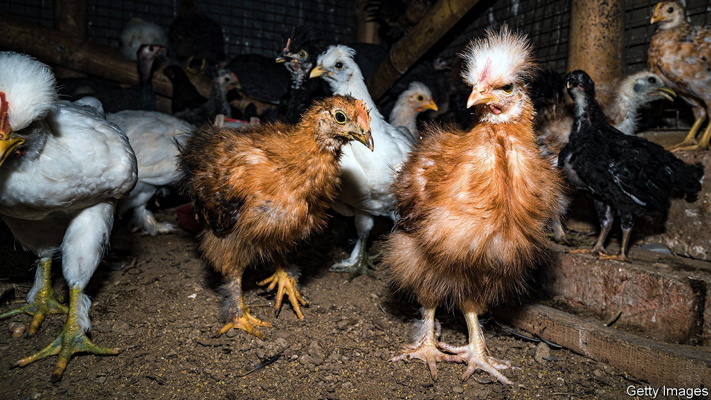

###### Palaeovirology

# Reviving ancient viruses can help fight modern ones 

##### Insights from evolution can also improve vaccines 

 

> Dec 14th 2023 

Humans work hard to dodge viruses. Sick people are quarantined, diseased livestock are killed and fields of infected crops set ablaze. All for good reason. Viruses are everywhere: from snowy mountain-tops to grimy lake floors. Bringing old ones back to life seems like an idea from science fiction. Resurrecting an ancient virus would surely be a disaster.

But a new study led by Steven Fiddaman of the University of Oxford, and published in , defies this conventional wisdom. It shows how the resurrection of an ancient strain of virus can unlock the secrets of its evolution—and even improve the health of chickens today.

The virus in question is Marek’s disease virus (MDV), a killer of poultry. mdv causes inflammation and tumours in the lymphatic system of fowl, and kills more than 90% of unvaccinated chickens. Controlling it costs the poultry industry $1bn a year. Yet when it was discovered in 1907, MDV rarely caused death. 

Dr Fiddaman wondered whether its new-found virulence was a result of the aggressive growth of industrial chicken-farming. To find out, he and his colleagues got their hands on nearly 1,000 chicken bones procured from archaeological digs across Europe and Asia, some of them up to 2,000 years old. Fragments of DNA from these remains were mapped on to the genome of today’s virus. This approach identified MDV infections in chickens as far back as the tenth century. 

As the authors pieced together the ancient MDV genomes, however, they noticed that the genes were arranged identically to those in modern strains. That suggests that the increased virulence resulted not from large structural changes, but from point mutations. These are genetic tweaks that affect only one or two bases in a gene’s DNA sequence. Looking closely at the genome, the scientists found that a series of individual mutations had acted as a ratchet to increase virulence over the last century. In particular, changes had occurred in the sequence of a gene called , which has an essential role in tumour formation.

This discovery suggests that the ancient MDV may not have been able to cause tumours. To test this hypothesis, Dr Fiddaman followed up with a daring experiment. He synthesised the ancient form of the  gene and inserted it into living chicken cells. It did not turn on any of the genes associated with tumour formation. In comparison, a modern gene quickly showed its aptitude to cause tumours.

Over the last century humans have made chickens the most common bird on the planet (there are now 35bn of them), accelerating the pace of the virus’s evolution. It is unusual that MDV has evolved in the direction of greater lethality; if birds die before infecting others the virus would die out. But a combination of overcrowding and the use of “leaky” vaccines, which alleviate symptoms but do not stop transmission, has kept them alive for long enough for fatal strains to thrive. By focusing on raising more fowl, humans also managed to raise a killer virus, says Laurent Franz, a senior author on the paper. That seems scarier than resurrecting an old one in the lab.

By fusing archaeology and modern genetic biology, the methods pioneered in the paper reveal how, and more importantly why, any virus mutates. That could help scientists tackle other parasites that pull on the purse-strings of livestock farmers—by designing new vaccines, for instance—or even to work out how to avert another global pandemic. ■


