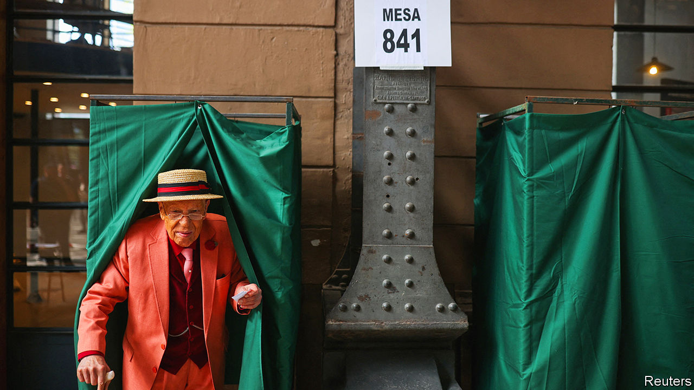

###### A constitutional quagmire

# For a second time Chileans reject a new constitution. Now what? 

##### After four years of discussions over a new basic law, patience is wearing thin 

 

> Dec 18th 2023 

For the past four years Chileans have engaged in a rare democratic experiment. They have twice been asked to vote on a new constitution, and twice they have rejected the product on offer. The discussion kicked off in 2019, when violent protests over inequality rocked the country. Politicians offered citizens the chance to elect an assembly to write a new social contract. But the assembly was dominated by the hard left and alienated most voters. In a referendum in 2022 nearly two-thirds of Chileans voted against the charter. Then the politicians offered citizens the chance to elect an assembly to have another go. This time it ended up being dominated by the right. On December 17th, 56% of voters rejected its proposed text.

The constitutional rewrite was marked by a widespread lack of interest and rising dissatisfaction with politics. According to Roberto Izikson of Cadem, a pollster, most Chileans considered the process this year a “waste of time”. Since 2019 Chileans’ priorities have shifted from pensions, health care and education to crime, economic problems and immigration. Meanwhile, the unpopular left-wing administration of Gabriel Boric has been unable to pass serious reforms while waiting for the outcome of the two constitutional processes. Many Chileans are losing patience. Only 52% of those polled say that democracy is the best form of government, compared with 64% in August 2021.

On the face of it, the rejection of the draft is a victory for Mr Boric, whose allies did not support the text. A third constitutional process is out of the question for now, allowing the administration to get on with governing. Yet if it is a victory for Mr Boric, it is a bitter one. The president and many of his millennial allies made a name for themselves in part by criticising the current constitution, which was first approved in 1980 during the military dictatorship of Augusto Pinochet, but which has been heavily amended since. Now they must live with it.

The first convention was dominated by scandals. Many of the assembly’s 155 members were left-wing independents without party discipline. Their proposed charter was prolix and filled with bizarre clauses, including rights to “digital disconnection” and food that is “culturally appropriate”.

When that draft was rejected, politicians tried to avoid another fiasco. Though they gave the go-ahead for another assembly, they put guardrails around it. They agreed to 12 principles that had to be maintained in any new charter, including the independence of the central bank. They convened a commission of 24 legal experts from across the political spectrum to write a first draft. A convention of 50 members would then be elected to edit it.

The experts’ commission got to work in March and was a model of consensus-building. The draft proposal retained the current constitution’s strong protections of private property while fulfilling long-standing demands of the left, such as one for a chapter on the environment. Verónica Undurraga, the body’s president, says it was defined by “political realism”.

Such moderation did not survive the election of the assembly. Twenty-three seats on the body went to the hard-right Republican Party, led by José Antonio Kast. Another 11 were won by Chile’s traditional right. “In the last convention the majority abused its power and drafted a text beyond the pale for most Chileans,” says Loreto Cox of the Pontifical Catholic University of Chile. “This time the Republicans took a text that had consensus and turned it into something much more divisive.”

Rather than merely edit the draft, the assembly rewrote it. According to Unholster, a data company in Santiago, the capital, only 23% of the wording from the experts’ draft was maintained. Some ideas appear to have been imported from the global culture wars. 

The draft included a right to conscientious objection, more limited versions of which have been cited by religious business owners in the United States in order to decline service to LGBT customers. When made the highest law, it “basically gives you the right to exempt yourself from compliance with the law on the basis of your beliefs,” says Domingo Lovera, who sat on the experts’ commission. The draft constitution also entrenched Chile’s restrictive laws on abortion (it is already only permitted in cases of rape, threat to the mother’s life or fetal non-viability). 

The assembly’s draft included numerous populist giveaways. It all but abolished a property tax that most Chilean municipalities depend on for their revenues, as well as including an article that would have allowed Chileans to deduct any “expenditures necessary for life, the care or development of the person and their family” from “corresponding taxes”. This could undermine the collection of income taxes, which are paid only by the richest quarter of Chileans and amount to 1.6% of GDP.

LarrainVial, a Chilean bank, compared the move to Liz Truss’s attempt in September 2022 to drastically cut taxes in Britain, when she was briefly prime minister. Instead of boosting growth, the bank warned that such unfunded tax cuts could signal the start of a fiscal spiral “reminiscent of Argentina or Greece”.

The Republican Party led a polarising campaign focused on Mr Boric’s low approval ratings, rather than the contents of the constitution. One video consisted of a single chant: “Boric votes against, Chile votes in favour.” Many Chileans balked at such tactics. The share of respondents who say they prefer political leaders who seek consensus over those who defend their stance at the expense of reaching agreements has risen from 59% in June to 70% today, according to the Centre of Public Studies, a Chilean think-tank. Voters tend to be more liberal than the authors of the new constitutional draft, too. Only 15% say they want to ban abortion completely. 

Chile could now go in several directions. The first would be positive. To write a new constitution, politicians have had to reduce the quorums needed in Congress to modify the current one. That could now allow Congress to improve the current charter with some suggestions from the experts’ report. Indeed, consensus could come back into vogue. On the night of the results Mr Boric said he would prioritise a pension reform that has stalled in Congress for years. It would gradually increase the contribution rate from 10% to 16%, with most of the extra cash going to a common fund. Mr Boric’s ambitious tax plan, which seeks to increase revenues by 2.7% of GDP, seems less likely to pass.

The other option is negative. Chile holds local elections in 2024 and general elections in 2025. There are only a few months to enact reforms before parties begin campaigning. If voters believe the next few years will be wasted, as many feel the last four have been on the constitution, they will get fed up. That, warns Mr Izikson, the pollster, could “open the door to authoritarian populism more than ever”. ■

