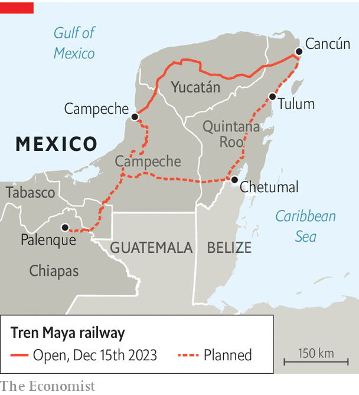

###### Money down the train

# The Mexican president’s latest boondoggle officially opens 

##### The Maya Train will not be fully operating until February 2024, however 

 

> Dec 20th 2023 

On coming to power in 2018 Andrés Manuel López Obrador, Mexico’s president, promised to boost the fortunes of the poor south-east. His flagship project to do so is a 1,500km (970-mile) tourist railway, known as the Tren Maya, connecting towns, beach resorts and ruins around the Yucatán peninsula, which the president inaugurated on December 15th. 

The opening was a bit of a damp squib. Billboards adorned with toucans and lush vegetation along the coastal road between Tulum and Cancún have long announced that the train “is here”, but workers in hard hats suggest otherwise. In Mr López Obrador’s haste to finish various mega-projects—a refinery, a new airport in Mexico City and an interoceanic corridor in the south—he often opens them half-finished. For now the train is only operating on the stretch between Campeche and Cancún, on a limited timetable. The first journey took over nine hours, far longer than by car. The president says the rest will start operations by the end of February 2024. 

 


The railway’s construction has generated some impressive figures. The government says the project has created over 100,000 jobs. It says the train will bring opportunities to out-of-the-way villages and towns by encouraging tourism, as well as by moving locals and freight. 

But many analysts doubt the train will boost the economy for long. Many jobs are temporary, linked to laying the tracks. It is unclear how many tourists will use the train. Locals will struggle to afford it: a ticket for the first stretch costs 1,166 pesos ($68), nearly a week’s average salary. The government reckons that the railway will cost more than triple its original budget of 120bn-150bn pesos, a huge sum that might have been better spent on basic infrastructure the area lacks, such as roads, drinking water and electricity. José Gasca Zamora of the National Autonomous University of Mexico reckons the government will be subsidising the train for years to come. 

Others highlight the damage caused by the construction, including felling trees and inadequately protecting archaeological remains. “It is environmental devastation,” claims Gemma Santana of Sélvame del Tren, a protest group. Some indigenous communities along the route have objected to it.

In 2019 Mr López Obrador held a referendum on whether to build the railway. He won, but fewer than 3% of eligible voters turned out. To speed up the process—and, sceptics say, to conceal information—he gave certain stretches of the railway to the armed forces to build. They will also operate it. In 2021 he declared the project a national-security matter, reissuing the decree this year after the Supreme Court struck it down. His railroading may pay off. But the project may yet prove to be a train wreck. ■

