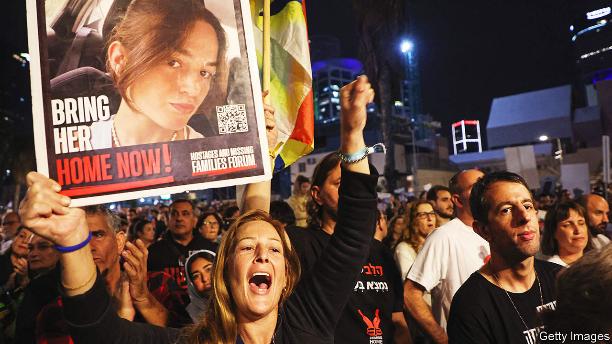
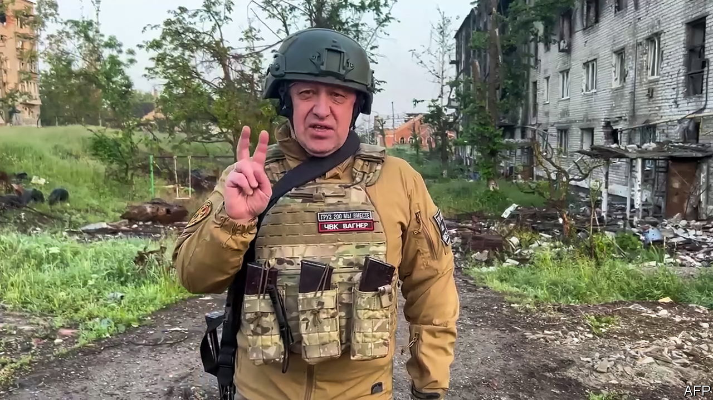
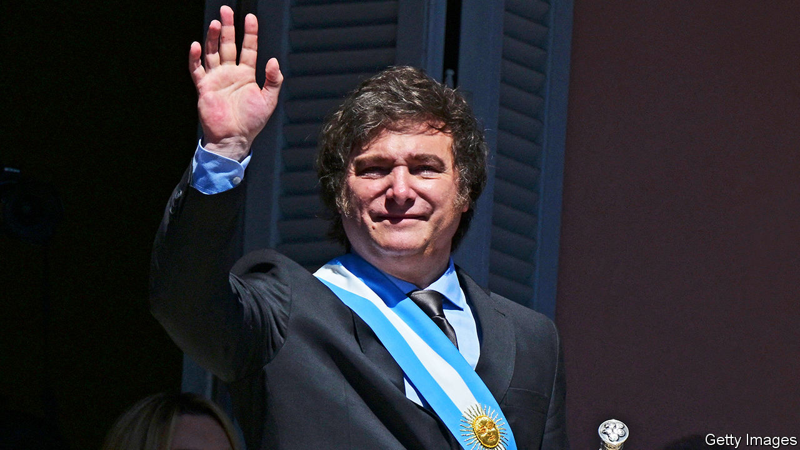
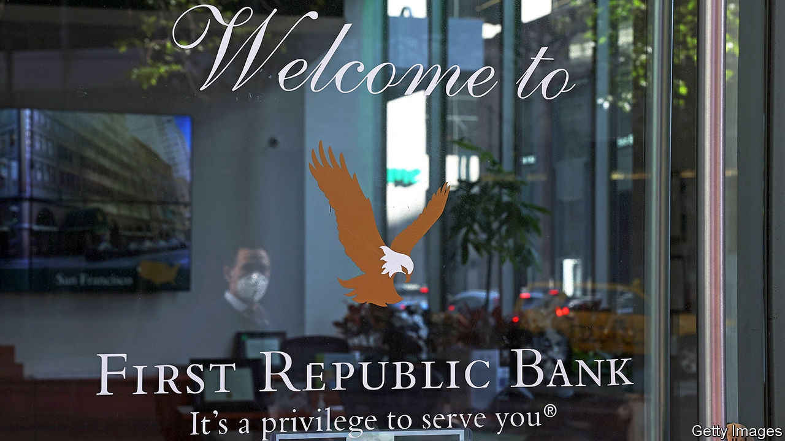
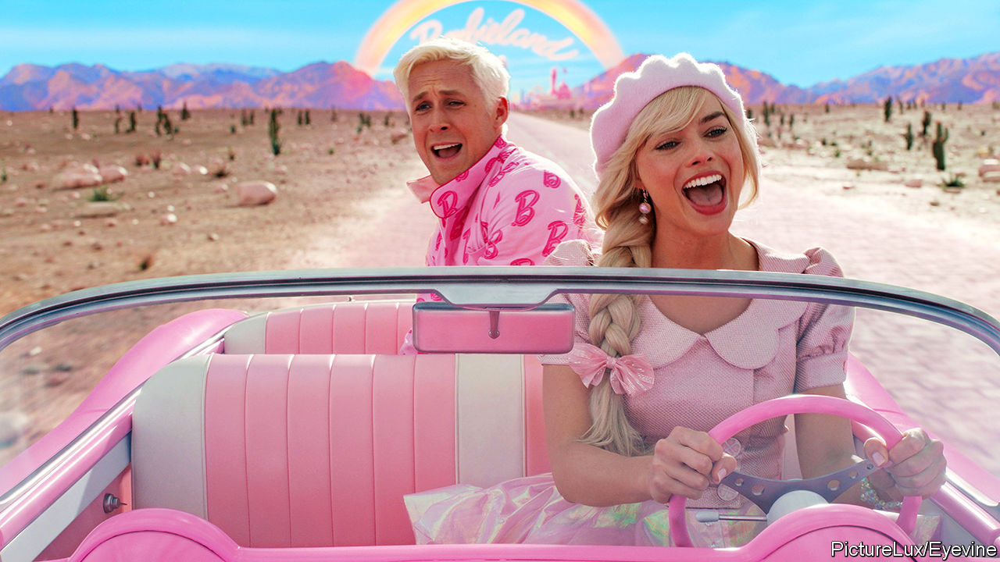

###### The world this week

# The world this year 2023 

#####  

 

> Dec 20th 2023 

Less than six months after celebrating the 75th anniversary of its founding,  suffered its worst-ever terrorist attack. On October 7th Hamas militants crossed from  and went on a  in the surrounding area, killing 1,200 people, 364 of them at a music festival. Some 240 people were taken hostage. The scale of the attack, the mutilation of bodies and brutal assault of women shocked the world, yet antisemitism surged. Israel launched a war on Hamas in Gaza, flattening swathes of the Palestinian territory and killing 20,000 people, including militants. By the end of the year America was signalling to Israel that it should seek to wind down the conflict. 

Before the Hamas attack  government was already under pressure, as hundreds of thousands of Israelis took to the streets in a wave of rallies to protest against controversial reforms to the judiciary. 

God rest ye merry gentlemen

In a historic first, America’s  . Kevin McCarthy was brought down by a group of right-wing Republicans who were angry that he had sought Democratic support to avoid a government shutdown (the Democrats then deserted Mr McCarthy and voted to remove him). It took the dysfunctional Republicans a few weeks to choose a new speaker, Mike Johnson. 

 became the first American president, former or sitting, to face . The year ended with Colorado’s Supreme Court ruling that Mr Trump was ineligible to run in the state’s primary because he fanned the insurrection in Washington in January 2021. Mr Trump faces 91 criminal counts across four cases. 

Russia’s war on Ukraine dragged on.  counter-offensive against the invaders didn’t make much headway, though Volodymyr Zelensky claimed some success in diminishing Russia’s naval power in the Black Sea. After Russia pulled out of a deal guaranteeing safe passage of grain exports from Black Sea ports, Ukraine began shipping goods from alternative ports on the River Danube. 

Finland , a poke in the eye for Russia, which thought its aggression against Ukraine would weaken the military alliance. Sweden’s bid for membership was still held up by Hungary and Turkey. 

 


Vladimir Putin faced the biggest challenge to his autocratic presidency in a decade when , the leader of the Wagner mercenaries, rebelled and , because he thought Russia was mishandling the war. The speed at which his armed troops advanced caught the Kremlin by surprise. Civil war was forecast before Prigozhin abruptly ended his uprising. He was killed in a plane crash two months later. Prigozhin had “made serious mistakes in his life”, Mr Putin said archly, soon after the crash.

A  by Azeri troops captured , an enclave in Azerbaijan that has been fought over with Armenia since the collapse of the Soviet Union in 1991. Nearly all of Karabakh’s ethnic Armenian population fled to Armenia. 

After an aggressive 15 months of tightening and a considerable easing of inflation, the world’s  began a “pause” in raising interest rates. The Federal Reserve has signalled three cuts for 2024. Ueda Kazuo started his term as the Bank of Japan’s governor, and is expected to start tightening its ultra-loose monetary policy in 2024. 

Generative  was all the rage, following the success of the ChatGPT chatbot. Virtually every company rushed out its AI strategy, but the speed at which the technology is progressing raised concerns, and lay behind a corporate clash that  Sam Altman as the boss of OpenAI. In a bizarre episode Mr Altman was quickly reinstated after most of the startup’s staff said they would quit if he wasn’t brought back.

Silver bells

 rebounded after a dismal 2022, boosted by the hoopla surrounding AI. The stock prices of Alphabet, Meta and Microsoft soared, as did those for chipmakers that power the AI revolution. Nvidia’s stock rose by 240% in 2023. The drug companies behind new obesity treatments, such as Novo Nordisk, also saw their value balloon. And with the pandemic over, travel companies fared well (though the American government lost track of the many complaints made against airlines). The share prices of Carnival and Royal Caribbean, two cruise lines, increased by 130% and 150% respectively. Tesla’s stock rose by 140%. 

It was another eventful year for , who changed the name of his social-media platform from Twitter to X. He later revealed that X is now worth $19bn, much less than the $44bn he paid for it. 

 Conservatives lost four by-elections as voters swung towards the opposition parties, a bad omen for Rishi Sunak ahead of a general election expected in 2024. Labour also snatched a seat from the Scottish National Party, which is losing its iron grip on Scotland. Nicola Sturgeon had earlier resigned as Scotland’s first minister. She was later questioned by police about her party’s finances. 

Come and behold him

 


 presidential election was won by , an unconventional self-styled anarcho-capitalist, who immediately slashed public spending and devalued the peso by over 50%. With annual inflation at 161% and interest rates at 133% Mr Milei described the central bank as a machine for “crooked” politicians to print money. 

In other elections the party led by Geert Wilders, a veteran far-right politician, came first in the .  moved to the centre-right by returning the National Party to power; Jacinda Ardern had earlier resigned as prime minister. The centre-right New Democracy party attained a rare parliamentary majority in . A right-wing coalition claimed victory in . The conservative People’s Party thought it had won in , but it couldn’t form a coalition so the Socialists returned to government, with the support of Catalan separatists in return for a controversial amnesty. In  the election victor also did not form a government. The royalist establishment didn’t like the reformist Move Forward party so parliament voted the Pheu Thai party into office instead. The establishment in  tried to derail the victory of Bernardo Arévalo, an anti-corruption candidate. A centre-left coalition won  poll, ending eight years of contentious rule by the Law and Justice party. Bola Tinubu won in  presidential election and Joseph Boakai in . Daniel Noboa was elected president of ; aged just 35, he is the youngest head of a democracy. 

A powerful earthquake that hit  caused many Turks to criticise Recep Tayyip Erdogan for the country’s lack of preparedness. At least 50,000 died in Turkey and up to 10,000 in Syria. The opposition thought it had a good chance of unseating Mr Erdogan in the presidential election, but in the end he won comfortably. 

 in Morocco and Afghanistan killed 3,000 and 1,500 people respectively. In Libya the town of Derna was deluged by  when heavy rains destroyed two dams. At least 4,000 people died, but 8,000 are still missing. 

Wildfires on the  island of Maui killed at least 100 people and destroyed the historic town of Lahaina. It was America’s deadliest wildfire disaster in a century.

The number of coups in west and central Africa since 2020 rose to eight, when the governments of  and  were taken over by the army. A new genocide emerged in the Darfur region of , as Arab militia slaughtered ethnic African groups there. 

 was engulfed by political turmoil after Imran Khan, who was ousted as prime minister in 2022, was  on corruption charges that he says are politically motivated. Terrorists carried out more bombings, targeting a mosque in Peshawar and killing 84 people. Later in the year the government blamed Afghan migrants for the wave of attacks and ordered their expulsion from the country. 

 


Markets were rattled by another  that had echoes of 2007-09. The Federal Reserve and other regulators stepped in to protect depositors at Silicon Valley Bank and Signature Bank when the two lenders collapsed. Billions were wiped off banking stocks. Investors remained jittery, and several weeks later First Republic Bank also went down, the second-biggest bank failure ever in America. 

Amid the turmoil  also went under. It was eventually rescued by  in an emergency takeover, bringing an end to 167 years of independence. Boosted by its new assets UBS reported a quarterly profit of $29bn, a record for any bank. 

Joy to the world

Other business highlights included  stepping down as chairman of both Fox and News Corporation, handing the reins to his eldest son, Lachlan;  being found guilty of fraud for his role in the collapse of FTX;  floating on the Nasdaq exchange in the year’s biggest IPO; and  buying Pioneer Natural Resources for $60bn, its biggest acquisition since purchasing Mobil in 1999.

In  supporters of the former president, Jair Bolsonaro,  the country’s Congress, presidential palace and Supreme Court, whipped up by false claims that he had been robbed of re-election in 2022. Luiz Inácio Lula da Silva, the winner of that election, described the protesters as “fanatical fascists”. 

 suffered its worst riots since 2005, sparked by the fatal shooting of a teenager of north African descent by the police in Paris. Cars were burned and shops looted as the violence spread throughout the country. Earlier in the year widespread protests against the government’s pension reforms also turned violent. 

 economy showed signs of recovery at the beginning of 2023, after strict pandemic controls were lifted. But the rebound turned out to be a damp squib. The year was marked by waning exports, defaulting property firms and deflation. Economists pushed back their forecasts of when China would overtake America as the world’s biggest economy, if it happens at all. 

’Tis the season to be jolly

 


Film production came to a halt in  as writers and actors went on , their first simultaneous union action since 1960.  was the biggest box-office hit, released on the same day as , another huge money-spinner. One movie is a tale of brilliance, hubris and relentless drive and the other is a biopic of the father of the atom bomb.

