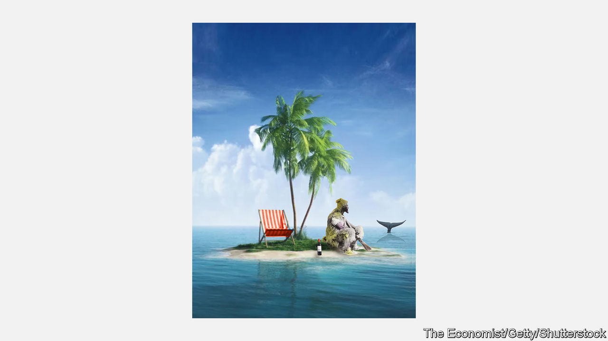
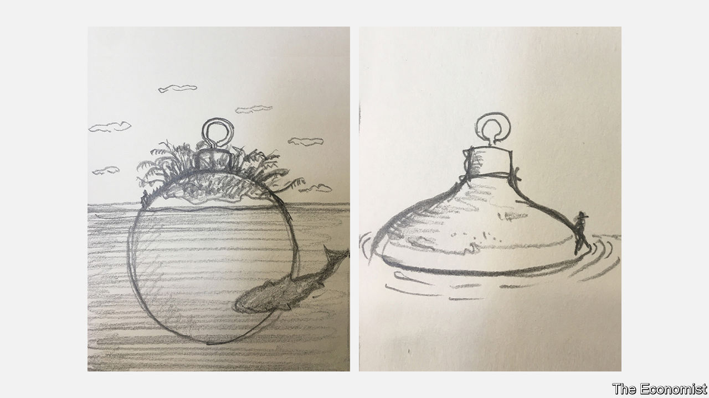
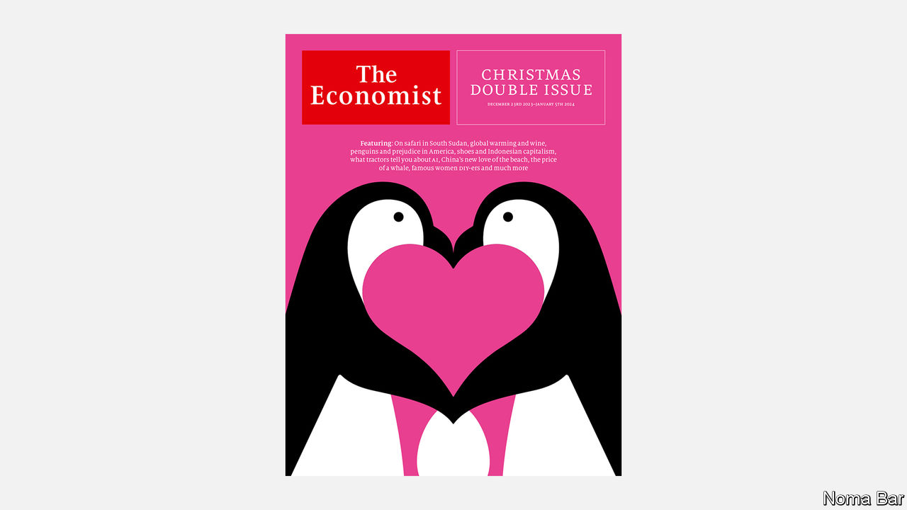
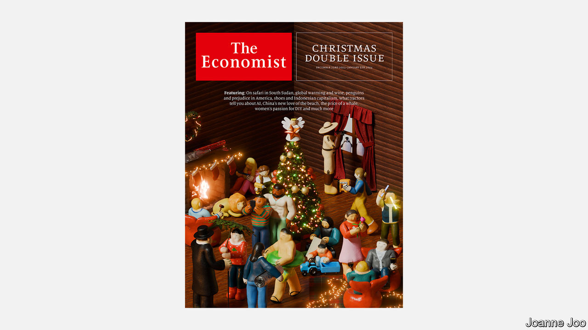
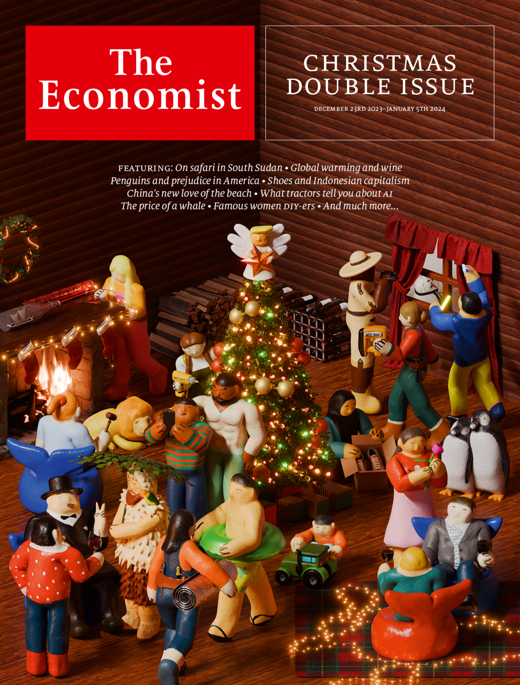

###### The Economist

# This week’s cover 

##### How we saw the world 

> Dec 20th 2023 

AS ALWAY, OUR Christmas cover eschews the news in favour of an image inspired by the special features that fill half the issue. This year these pieces cover, among other things, the intricacies of , how climate change is  and the adventures of a .

Another story, on why economists , inspired three possible cover ideas. The first featured the eponymous hero stranded on his island with a bottle of wine and a  in the distance, visual references to two other pieces in the issue. It was charming, but lacked a sense of seasonality. 

 


The other two drew on two other stories that nod to the sea—about the history of  and on China’s evolving love affair —but used as their central image a Christmas tree bauble. The first of these showed the ornament floating in the water, its top emerging as Crusoe’s island and the whale swimming below. The second used just the top of the bauble, bobbing along with Crusoe teetering on its edge. Both were fun, but neither quite worked. 

 


Another cover image was based on the artwork that accompanies a piece about how a children’s story about  was caught up in America’s culture wars. The illustrations are delightful, but felt better suited to a cover timed around Valentine’s Day than Christmas. 

 


Fortunately, the ideas kept flowing from our designers. One drew on that story about Chinese people’s fondness for the beach. The image depicted a snowglobe containing a holidaymaker reclining on a deckchair as the snow swirls outside—a neat inversion of the typical ornament. It was wintry, but had a sense of the unexpected. It nodded to a story without giving too much away. It could work. 

 


The final option was completely different. For an article about women finding fame online with their  Joanne Joo, a Chinese illustrator based in Thailand, produced a set of wonderful illustrations using 3D figures. The cover she designed featured several of the characters our journalists had written about throughout the issue, working together to decorate a log cabin. It had two strengths. First, its visual references to different stories helped convey the extravagance of the issue. Second, its mood of joyful warmth felt appropriate at this time of year. 

Joanne’s first version worked well, but the details needed refining. , a horrifying fairy perched atop the Christmas tree, was not sufficiently recognisable. Nor were Churchill or Crusoe. The woman kneeling with a shoe box could have been holding a box of anything. And a wall on the left looked sad and blank in contrast to the colourful jumble of the rest of the picture.

 


The final iteration was better. Churchill was more Churchillian, Crusoe more Crusovian. St Donald had a quiffier quiff. A wine rack and a stack of logs made that back corner feel less empty. A final round of edits fixed the final niggles: the ostracised penguins at the window were brought in from the cold and the shoes made more apparent. The cosy scene was set. It includes hints to each one of the Christmas stories in the issue—can you spot them all? 

 


