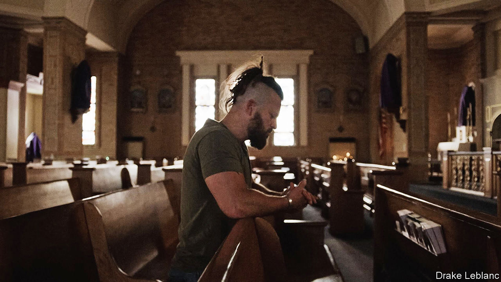

###### The fais do do

# Louisiana Creole is enjoying a modest revival 

##### Youngsters are trying to resurrect a culture beaten out of their grandparents 

 

> Dec 20th 2023 

Jourdan Thibodeaux has had a job every day since his tenth birthday. These days the dreadlocked millennial flips houses, manufactures pork sausages and raises two little girls. But the project of his lifetime is resuscitating his family’s heritage with his voice and his fiddle. 

Born of African, French, Native American and Spanish descent in south-western Louisiana, he speaks with an accent your correspondent had never heard. Loss is the subject of his ballads. Young people of the bayous have forgotten their families, he laments in French, and understand only their conqueror’s language. Kneeling in a church pew he confesses that he fears it will all die with him: “Tu vis ta culture ou tu tues ta culture, il n’y a pas de milieu,” he sings, “You live your culture or you kill your culture, there is no in-between.” 

The story of that culture dates back to before America’s founding. One year after the French settled New Orleans in 1718 the first slave ships docked on Louisiana’s shore. Feeding a hungry economy took many hands and after two decades there were four slaves for every free person in the colony. Sugarcane, the region’s cash crop, was particularly labour-intensive, which made communication between the Europeans and Africans critical.

Masters learned words from West African languages and slaves picked up on some French. Together they crafted a new hybrid language known as Kouri-Vini, or Louisiana Creole. By the time America purchased Louisiana in 1803 Kouri-Vini had become the language of the swamp, spoken alongside French. Slaves became fluent, working-class whites learned it on plantations and black nannies taught it to children of the wealthy. 

Just as the language fused, so too did the people. Because the French—and Spanish, who briefly ruled the colony—were Catholic, they believed their slaves had souls and ought to be baptised (a view generally not shared by Protestant masters). The church’s endorsement gave permission for more social integration than in other parts of the South. Masters chased black and native women and passed down land to mixed children. Surnames, like LeBlanc and Broussard, ceased to denote race. Songs melded African syncopation with French melodies. The brutalities of slavery persisted, but Louisianans of all colours came to call themselves Creoles. 

Pas possible

During Reconstruction Southern Democrats, opposed to their northern conquerors, replaced Creoles in the legislature and imposed a binary view of race that felt as exotic to south-western Louisianans as the English they spoke. Jim Crow enforced a social order in black and white. Light-skinned Creoles grew uncomfortable with the ambiguity they had always known; some moved away to start over as white. 

In 1921 Louisiana’s government decreed that English alone be taught in schools. Pupils who spoke Kouri-Vini or French were made to kneel on rice and beaten. Both languages were deemed “foreign”, though one was as native as could be. Humiliated children taught their younger siblings English to spare them from punishment. Though there are no official counts, historians reckon the number of Kouri-Vini speakers has probably dropped from about 1m in the 1910s to roughly 5,000 today.

Then, in the 1960s ethnic pride became voguish. Alongside the red- and black-power movements that grew out of civil rights, Louisianans started their own. They called themselves Cajun, not Creole, and it was just for whites who descended from the Acadians, exiles who came to Louisiana from Canada with their own kind of French in the late 18th century. Cajun culture drew tourists who came to taste gumbo and jambalaya and tour the alligator-infested rivers. In 1968 the state launched the Council for the Development of French in Louisiana (CODOFIL) to revive spoken French. By the turn of the century the group was importing young Europeans to teach in new French-immersion schools. But the language still carried a stigma. And though kitschy tourism of their shared culture boomed, black people had no place in it. “Creole was the red-headed stepchild,” says Christophe Landry, a historian. 

Today a coalition of young people of all shades is bringing back what it means to be from the Louisiana that preceded America, in all its messiness. Mr Thibodeaux, who hunts alligators, is deeply devout and whose French Instagram has nearly 100,000 followers, wants to incentivise local bars to serve patrons in the old languages. Taalib Pierre-Auguste, a 20-year-old from Ascension Parish, lobbies lawmakers to back French and Creole projects. The first indigenous French-immersion school opened this fall. “We are beginning a solemn and unshakable march to finally realise a dream,” the revivalists wrote in September. Older folk still warn youngsters not to speak “ghetto” languages in public.

Mr Pierre-Auguste has watched his childhood friends leave Louisiana for better opportunities and worries that the state’s new Republican governor will accelerate the exodus. Rising seas and storms also threaten life on the prairies. On a cool evening he sits on the steps beneath the state capitol, the tallest in the country. “Leaving Louisiana is like leaving me,” he says when asked if he would consider it. He hopes to run for office and create something for his generation to return to. Without them the culture cannot last. When the elderly who know it best die, there will be nothing authentic left to sell. ■


