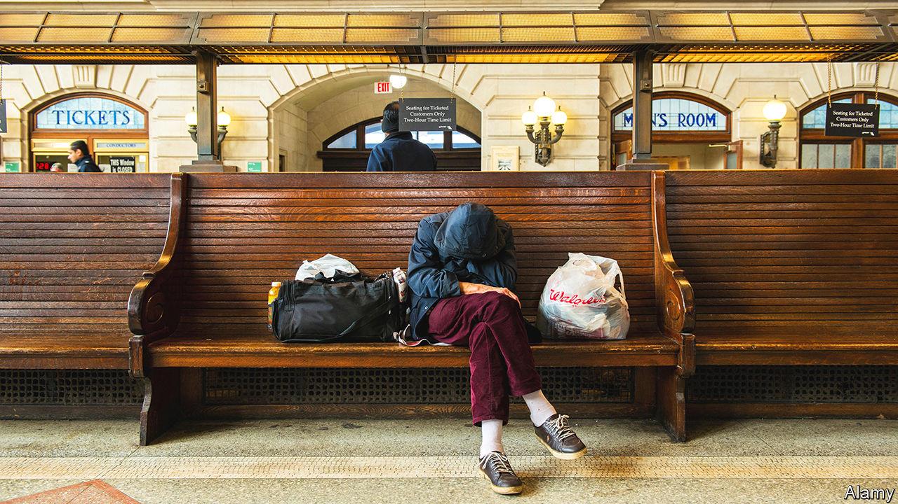

###### Jersey sure

# Newark may have found a fix for chronic homelessness 

##### Working with police, and converting shipping containers into housing, seem to help 

 

> Dec 20th 2023 

ON A SINGLE night every January, volunteers all over America search parks, woodlands, subway tunnels and pavements to count those without shelter. It is part of the annual count mandated by the federal Department of Housing and Urban Development. The point-in-time count results were released, at last, on December 15th. Roughly 650,000 people were homeless, a 12% increase over the year before. The count is the highest since reporting began in 2007. The snapshot is useful for spotting trends and attracting federal funding. Most experts agree it is an undercount and often out of date.

After seeing their own figures for homelessness increase by 20% between 2022 and early 2023, New Jersey officials were shocked into action. Officials tweaked existing programmes and spent more on rental assistance for those at risk of becoming homeless. More services for people living rough has led to a rise in sheltered homelessness. The state also gathers near-real-time data, rather than taking an annual snapshot. In November New Jersey’s Office of Homelessness Prevention released its own figures. They showed unsheltered homeless falling across the state by 23% year on year.

Newark, New Jersey’s largest city and home to the state’s largest homeless population, recorded the biggest decrease. A year ago Ras Baraka, the mayor, unveiled a plan bringing together state, local and private-sector financial support to reduce street homelessness, improve the shelter system and expand housing and prevention services. Mobile crisis teams, behavioural-health providers, community leaders and the police formed a coalition. It seems to be working. Newark has achieved a 58% reduction in unsheltered homeless since the start of the year.

Luis Ulerio, the director of Newark’s Office of Homeless Services, says “there’s just been a lot of hard work behind that number.” The mayor converted a local primary school into a 166-bed facility. He built transitional housing out of shipping containers, a common sight in the nearby port. A second cluster of containers with supportive services, called Hope Village II, will open soon. The containers have been altered to look like little cottages. One woman who had been living in a nearby petrol station for over a year has been persuaded to move in. A third cluster is in the works. Mr Baraka wants to create a pipeline from shelters to transitional housing to giving section-eight vouchers (a federal housing programme) to getting chronically homeless people into permanent housing.

Legal teams offer free counselling and court representation to people who risk being illegally evicted. The city also provides money for back-rent. Beth Shinn of Vanderbilt University points out that there are “lots of points of intervention”, on the theory that it is cheaper to give $200 to help make rent than to pay thousands later. The city also relies on data, updated daily by those working with Newark’s homeless. “What we’re doing is essentially moneyballing homelessness,” says Michael Callahan, head of the state’s Office of Homelessness Prevention. Near-real-time data is crucial, he says, in order to pivot interventions in state policy and on the front line—even helping assign which outreach team will work a certain night shift. ■


