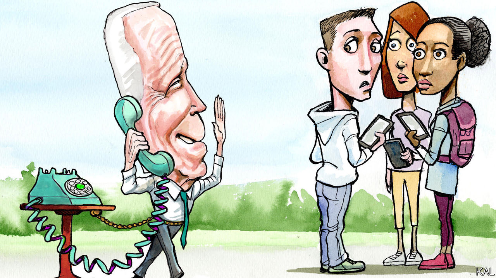

###### Lexington

# Why Donald Trump is gaining ground with young voters 

##### Joe Biden is struggling both on substance and on style 

 

> Dec 20th 2023 

As tastemakers, the two previous American presidents could not present a sharper contrast. Barack Obama, with his elegance and irony, still issues year-end lists of the best music, movies and books, each a triumph of accessible urbanity that blends in just enough Lizzo and “Top Gun: Maverick” to help the Abdulrazak Gurnah go down. To Mr Obama’s mix-mastery Donald Trump counterposed a signature style of ostentatious kitsch. His braggadocio, his combativeness, his gilded lairs, his manner of associating with women: all these led a writer, Jelani Cobb, to note as far back as 2015, “in all the ways that matter, save actual performing, Donald Trump is not a politician—he’s a rapper.”

And yet, as president, Joe Biden has found a way to stand apart from both the DJ and the rapper, and from all other presidents of the modern era: he is leaving almost no cultural imprint whatsoever. John Kennedy may have altered the course of men’s fashion by not wearing a hat during his inauguration, but Mr Biden failed to spark a revival of The Staple Singers by including their music on his inauguration playlist. Aviator glasses and ice cream cones, maybe a ride in Delaware on a bicycle, are the pop signifiers, to date, of the Biden presidency. 

It would, of course, be patronising to suggest that Mr Biden’s lack of engagement with the broader culture, rather than his handling of weighty affairs such as the war in Gaza, is behind his struggle to connect with young Americans. But it cannot be helping. What is clear is that he has a problem, one that encapsulates his overall challenge headed into his re-election campaign. Young voters, who were key to his win in 2020, are just not into him. 

No Republican candidate for president has won most voters under the age of 30 since 1988. But a poll by the  and Siena College published on December 19th found Donald Trump leading Mr Biden by 49% to 43% among voters aged 18 to 29. That is a swing in this poll to Mr Trump of ten points since July. According to the Pew Research Centre, in 2020 Mr Biden won that age group by 24 points, 59% to 35%.

The polling has been so dismal for Mr Biden, and also so erratic, and confidence in polling has been so shaken in recent years, that a debate has broken out among political obsessives over whether to trust the numbers. Within national polls, subgroups such as young voters comprise smaller samples and so yield larger margins of error. To control for this, a group called Split Ticket in early December aggregated subgroups across numerous national polls. The results showed Mr Biden leading Mr Trump by a diminished but still substantial margin of 16 points among voters under 30, yet by only three points when young voters were defined as those under 34. That is a sign both that there is static in the numbers, and that the danger to Mr Biden’s re-election is real.

Republicans sense an opportunity. Joe Mitchell, a former Iowa state representative who runs a group called Run GenZ that recruits young conservative candidates, says what he hears most is that “we had more money in our pockets when Donald Trump was president”. But he argues that Mr Trump’s cultural heft is an advantage as it has not been since 2016. Mr Biden, he says, has passed more progressive legislation than Mr Obama but is less admired by progressives because he lacks Mr Obama’s cachet. By contrast, the indictments of Mr Trump have restored his celebrity gleam. “People were displaying his mugshot in a positive way,” says Mr Mitchell, who is 26. “He’s up with the Tupacs of the world.” 

The Republican National Committee has created a “youth advisory council”, and it staged its first primary debate in concert with a group for young conservatives. But Republicans have problems of their own. When a college student at that debate asked how the candidates would calm “fears that the Republican Party doesn’t care about climate change”, most of them ducked for cover. And in mid-December, five of the 16 members of the youth advisory committee quit, citing a problem evocative of the Trump years: a lack of organisation, goals and vision.

The latest iteration of the Harvard Youth Poll found that Americans under 30 did not much trust either probable nominee. But they trusted Mr Trump more on the economy, national security, the Israel-Hamas war, crime, immigration and strengthening the working class. They trusted Mr Biden more on such issues as climate change, abortion, gun violence and protecting democracy. 

In that poll, Mr Biden led by 11 points among all young Americans, but he appears to owe most of that support to Mr Trump. Most of those who favoured Mr Biden—69%—said they did so more out of opposition to Mr Trump; by contrast, 65% of those favouring Mr Trump said they felt loyal to him. That underscores the risk to Mr Biden of a third-party candidate siphoning the anti-Trump vote. The Harvard poll showed Mr Biden’s lead diminishing substantially when people were also asked about such candidates.

Always being boring, never being bored

Mr Biden’s age and lack of cultural effect were advantages in 2020. After the chaos of the Trump years, he was a calming, grandfatherly presence who would never pop up, beet-red and shouting, between images of Taylor Swift and bubble tea in anyone’s social-media feed. “America Votes to Make Politics Boring Again,” the publication declared after that election. On this implicit promise, Mr Biden has not delivered. And the very fact that many of the developments on his watch, such as the wars in Ukraine and Gaza, are beyond his control only reinforces the problem. 

This is Mr Biden’s real style problem: he does not appear to be in control. Rather than cocooning the president, his aides need to find more ways to present him as a commanding presence. Failing that, they could make more use of the cabinet secretaries and portray Mr Biden as the wise leader of a high-functioning team. Mr Biden has a good case to make, and he needs to make it both on substance and in style. ■


